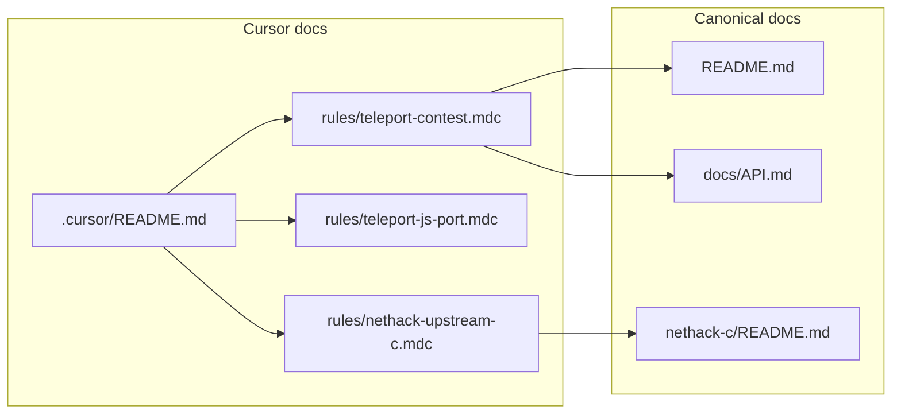

# Cursor documentation for Teleport contest + upstream C

## Commit workflow (agent)

- After each completed plan **todo** (or a clearly separable subtask within one todo), **create a git commit** that contains only the changes for that unit of work.
- Prefer small, reviewable commits over one large dump; do not mix unrelated files into the same commit when they correspond to different todos.
- Use the repository’s existing commit message style; write **why** the change exists, not only what files moved.

## Context (from this repo)

- **Contest**: [Teleport Coding Challenge](https://github.com/davidbau/teleport-contest) — port NetHack 5.0 behavior to plain ES modules in [`js/`](js/), scored per [`docs/API.md`](docs/API.md) via `runSegment` in [`js/jsmain.js`](js/jsmain.js). Frozen harness files: `js/isaac64.js`, `js/terminal.js`, `js/storage.js` (judge overlays them).
- **Upstream reference**: Git submodule [`nethack-c/upstream`](.gitmodules) → `https://github.com/NetHack/NetHack.git` at tag **`NetHack-5.0.0_Release`**. Patched recorder build + semantics notes live in [`nethack-c/README.md`](nethack-c/README.md) and [`nethack-c/patches/README.md`](nethack-c/patches/README.md).
- **Today**: There is **no** [`.cursor/`](.) tree yet; [`nethack-c/upstream`](nethack-c/upstream) may be **empty** until `git submodule update --init` — the upstream rule still applies once files exist.

## What to add

Implementation follows this plan; the first commit in the series is this plan file itself. Subsequent commits land **one todo at a time** (see Commit workflow above).

### 1. `.cursor/README.md` (human + agent index)

Short map of:

- Which rules apply when (`alwaysApply` vs globs).
- Pointers to canonical docs: [`README.md`](README.md), [`docs/API.md`](docs/API.md), [`docs/PHASES.md`](docs/PHASES.md), [`nethack-c/README.md`](nethack-c/README.md).
- One line: initialize submodule before asking the agent to grep/read C under `nethack-c/upstream/`.

### 2. `.cursor/rules/` — three focused `.mdc` files (per [create-rule](file:///Users/raphaelhervier/.cursor/skills-cursor/create-rule/SKILL.md): concise, one concern each, frontmatter with `description`, `globs` or `alwaysApply`)

| File | Scope | Purpose |
|------|--------|---------|
| `teleport-contest.mdc` | `alwaysApply: true` | Contest goals, **your constraints**: faithful port from **source semantics**, not binary transpilation; **do not** optimize for the 44 public sessions via hardcoded traces, session-specific screen/RNG tables, or “peeking” at `sessions/*.session.json` as implementation. Contest rules already forbid passing ground truth into `runSegment` — restate that agents must not treat public JSON as a spec to memorize. Link frozen files, sandbox (Node permissions), and category honesty (e.g. agentic vs transpiled per README). |
| `teleport-js-port.mdc` | `globs: js/**/*.js` | Practical port rules: ES modules, no build step, match **clang left-to-right** evaluation order for RNG-consuming expressions (called out in root README), instrument via existing RNG wrappers in [`js/rng.js`](js/rng.js), treat [`js/fastforward.js`](js/fastforward.js) as temporary scaffolding to remove as real logic lands — not a second answer key. |
| `nethack-upstream-c.mdc` | `globs: nethack-c/upstream/**/*` | How to use the C tree: tag `NetHack-5.0.0_Release`, typical layout (`src/`, dat files, Lua), relationship to **determinism patches** in [`nethack-c/patches/`](nethack-c/patches/) (recorder differs from vanilla only by those patches + env vars). Remind: reference behavior is **patched clang build**, not arbitrary local gcc. |

Keep each rule **under ~50 lines** of body text where possible so it stays actionable.

### 3. Optional but recommended: root `AGENTS.md`

Cursor commonly surfaces repo-root `AGENTS.md` for agent onboarding. A **5–15 line** file that says: “This is the Teleport fork; read `.cursor/README.md` and `.cursor/rules/`; do not edit frozen `js/` files; submodule path for C reference,” avoids burying onboarding only under `.cursor/`.

## Out of scope for this documentation pass

- Implementing port logic, changing scoring, or editing `sessions/`.
- Duplicating full API tables — **link** to [`docs/API.md`](docs/API.md) instead.
- Your later “global plan + sub-plans” for the actual port work.

## Verification after implementation (when you leave Plan mode)

- Open a file under `js/` and confirm `teleport-js-port.mdc` attaches; open (after submodule init) a file under `nethack-c/upstream/` and confirm `nethack-upstream-c.mdc` attaches.
- Skim rules for accidental encouragement of session-specific solutions or binary lifting.

