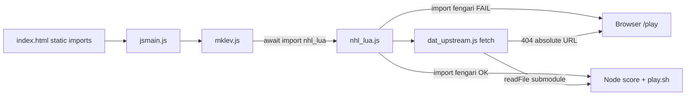

# Fix leaderboard Playable flag (browser deploy)

## Diagnosis

The [leaderboard Playable column](https://mazesofmenace.ai/leaderboard/) requires **both**:

1. **Clean browser load** — no failed module fetches, script errors, or 4xx/5xx subresources when Chromium loads `/play/<owner>/`
2. **Interactive speed** — per-keystroke `moveloop_core()` path stays under the judge threshold (local mirror: [`frozen/playability_runner.mjs`](frozen/playability_runner.mjs) uses **&lt; 1 ms/move** aggregate; leaderboard copy mentions **&lt; 5 ms/move**)

**Your fork already passes part 2 in Node:** `bash frozen/play.sh` → **PLAYABLE (0.76 ms/move)**. Scoring path is unaffected.

**Part 1 fails in the browser** because of NHL additions not present in the skeleton:

| Issue | Node (judge score) | Browser (`/play/richie3366/`) |
|-------|-------------------|--------------------------------|
| [`js/nhl_lua.js`](js/nhl_lua.js) `import * as fengari from 'fengari'` | Resolves via `node_modules/` | Bare specifier → failed module fetch; `node_modules/` is gitignored and [404 on play server](https://mazesofmenace.ai/play/richie3366/node_modules/fengari/package.json) |
| [`js/dat_upstream.js`](js/dat_upstream.js) browser branch fetches `/nethack-c/upstream/dat/*.lua` | Reads submodule from disk | Wrong absolute URL; submodule is a [gitlink only on GitHub](https://api.github.com/repos/richie3366/teleport-contest/contents/nethack-c/upstream) — [404 on play server](https://mazesofmenace.ai/play/richie3366/nethack-c/upstream/dat/nhlib.lua) |

`nhl_lua.js` is **dynamically** imported from [`js/mklev.js`](js/mklev.js) `loadLuaLikeC` (line ~397), so the static `index.html` import chain is fine until Mines/special levels run — but the judge’s browser drive **does** hit that path and records subresource failures.



## Fix strategy (full — your choice)

Keep **one** NHL implementation; make browser and Node load the same logic through environment-specific **loaders only**.

### 1. Commit browser-served lua dat (tiny, exact upstream copies)

- Add [`js/nhl_dat/nhlib.lua`](js/nhl_dat/nhlib.lua) and [`js/nhl_dat/minetn-1.lua`](js/nhl_dat/minetn-1.lua) — copy verbatim from `nethack-c/upstream/dat/` at tag **NetHack-5.0.0_Release** (~13 KB total; only files [`nhl_lua.js`](js/nhl_lua.js) loads today).
- Add a one-line [`js/nhl_dat/README.md`](js/nhl_dat/README.md) noting upstream provenance + tag (not game logic).

### 2. Unify `dat_upstream.js` paths

Update [`js/dat_upstream.js`](js/dat_upstream.js):

- **Browser:** `fetch(new URL(\`./nhl_dat/${key}.lua\`, import.meta.url))` (fork-relative, works on `/play/<owner>/js/...`)
- **Node:** `readFileSync` the **same** `js/nhl_dat/` path via `import.meta.url` (not submodule path), so browser and judge sandbox see identical lua text.

This avoids relying on submodule checkout on the play host while keeping C-faithful lua source.

### 3. Vendor fengari for browser (no bundler)

Fengari core is CommonJS; native browser ESM cannot `import 'fengari'` from npm. Official browser distribution is [**fengari-web**](https://github.com/fengari-lua/fengari-web) (single script → `globalThis.fengari`).

- Add [`js/vendor/fengari-web.js`](js/vendor/fengari-web.js) from the official release (v0.1.4+; MIT license).
- Add [`js/vendor/README.md`](js/vendor/README.md) with version + download URL.
- Optional helper: [`tools/vendor-fengari-web.sh`](tools/vendor-fengari-web.sh) to re-fetch the pinned release (keeps repo maintainable).

### 4. Load fengari-web in [`index.html`](index.html)

Before the `type="module"` bootstrap block, add:

```html
<script src="./js/vendor/fengari-web.js"></script>
```

(`index.html` is not frozen; contest scaffold already loads external Google Fonts the same way.)

### 5. Refactor [`js/nhl_lua.js`](js/nhl_lua.js) — lazy dual-runtime loader

**Remove top-level** `import * as fengari from 'fengari'` and `import { to_luastring } from 'fengari/src/fengaricore.js'` (these break browser parsing/resolution).

Replace with async `getFengariLikeC()`:

- **Node:** `await import('fengari')` + `await import('fengari/src/fengaricore.js')` (unchanged semantics for scoring)
- **Browser:** read `globalThis.fengari` set by fengari-web; map `lua`, `lauxlib`, `lualib`, `to_luastring`

Call `getFengariLikeC()` at the start of `runLuaProtofileLikeC` before creating the Lua state. All existing Lua bridge code stays the same after modules are resolved.

### 6. Regression gates (must stay green)

After implementation, run in order:

```bash
npm run score                    # PRNG + screen parity — primary no-regression check
bash frozen/play.sh              # Node interactive speed
python3 -m http.server 8000      # manual: open /, click terminal, move — no console 404/errors
```

Confirm in DevTools Network tab: no failed loads for `fengari`, `nhl_dat/*.lua`, or `nhl_lua.js` when starting a game that reaches Mines.

Push to `main` so the judge picks up the fix on the next leaderboard cycle ([`snapshot.json`](https://mazesofmenace.ai/play/richie3366/snapshot.json) currently points at an older commit).

## What we are **not** changing

- Frozen harness files (`js/isaac64.js`, `js/terminal.js`, `js/storage.js`)
- Game logic / RNG call sites (no fastforward/harness tuning)
- `package.json` `fengari` dependency (still used by Node dynamic import)

## Risk notes

- **fengari-web bundle size** (~hundreds of KB committed) — acceptable tradeoff for no-bundler contest rules.
- **Browser speed** — if Playable still fails after load fix, profile DOM `flush_screen` / `requestAnimationFrame` in [`js/jsmain.js`](js/jsmain.js) `animationFrame()`; Node headroom (0.76 ms) is large, but DOM may be slower. Address only if load fix alone is insufficient.

## Files touched (expected)

| File | Change |
|------|--------|
| [`js/dat_upstream.js`](js/dat_upstream.js) | Fork-relative `js/nhl_dat/` for browser + Node |
| [`js/nhl_lua.js`](js/nhl_lua.js) | Lazy fengari loader; no top-level npm imports |
| [`js/nhl_dat/*`](js/nhl_dat/) | Committed upstream lua (nhlib, minetn-1) |
| [`js/vendor/fengari-web.js`](js/vendor/fengari-web.js) | Browser Fengari runtime |
| [`index.html`](index.html) | `<script src="./js/vendor/fengari-web.js">` |
| [`tools/vendor-fengari-web.sh`](tools/vendor-fengari-web.sh) | Optional re-vendor script |
