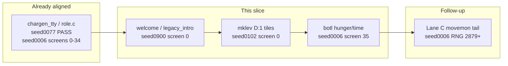

# Lane A — startup path for score progress

## Your choice vs handoff

You selected **Lane A (chargen/TTY ROI)** over **Lane C** (`seed0006` ~2879 `movemon`). That is reasonable for total score, but diagnostics show **pure `chargen_tty.js` work is not the main blocker** on the best-looking sessions:

| Session | Screens | First failure | Real gap |
|---------|---------|---------------|----------|
| [`seed0077-rogue-chargen`](sessions/seed0077-rogue-chargen.session.json) | **PASS** | — | Chargen already done |
| [`seed0006-wizard-water-demon`](sessions/seed0006-wizard-water-demon.session.json) | **35/123** | Screen **35** (1 status cell) | Chargen screens **0–34 OK**; moveloop tail is separate (Lane C) |
| [`seed0900-tourist-explore-actions`](sessions/seed0900-tourist-explore-actions.session.json) | **0/84** | Screen **0** (welcome top line) | RNG aligned to **301**, diverges **302** (`rn2(5)`/`rn2(3)` swap then `rn2(1000+)` chain) |
| [`seed0102-ranger-name-cancel`](sessions/seed0102-ranger-name-cancel.session.json) | **0/25** | Screen **0** (map + botl) | RC has full identity (`name:ricky,role:Ranger,...`); **not** interactive chargen menus |

**Score expectation this slice:** stay **2/44** unless a large screen chain unlocks (unlikely in one commit). Meaningful progress = **higher screen match %** on 2–4 sessions + **RNG index advance** on `seed0900` / `seed0102` without regressing passes.



---

## Root causes (verified)

### `seed0900` — screen 0 + RNG 302

- `node tools/diag_first_screen_fail.mjs seed0900-tourist-explore-actions.session.json` → **first fail 0**, diffs on row 0 (`It is written…` / welcome text layout vs JS).
- `node tools/diag_rng_window.mjs … 298 310` → first RNG mismatch **302** (`rn2(5)` vs `rn2(3)`), then swapped small draws, then C `rn2(1000)`… vs JS wrong sizes (classic **extra/missing draws before a large shuffle or mklev pass**).
- RC: only `OPTIONS=symset:DECgraphics` → full [`runInteractiveTtyChargen`](js/chargen_tty.js) in [`jsmain.js`](js/jsmain.js); chargen RNG is already aligned through ~301.

### `seed0102` — screen 0 (not name-cancel UI)

- First fail **0**: dungeon glyphs (`l`, `q`, `x`, `~`, `+`, `$`, …) at ~(20–21, 6–12) and status line (`R` vs `r`, `Chaotic` garbled, hunger digit).
- Session inputs `#name` / `name` are **in-game**, after startup; fixing **D:1 map + botl** comes first.

### `seed0006` — screen 35 only

- Screens **0–34 match** C; fail at **35** with one cell: row 23 col 32 **`0` vs `9`** (status/hunger/time field).

---

## Implementation plan (one slice, C-first)

### 1. Diagnose before coding (15 min)

- `node tools/diag_screen_diff.mjs seed0900-tourist-explore-actions.session.json 0` (or `diag_first_screen_fail` output) — capture exact welcome/legacy strings vs C.
- `node tools/diag_screen_diff.mjs seed0102-ranger-name-cancel.session.json 0` — map which `mklev` features C places at failing cells.
- In upstream: [`nethack-c/upstream/src/allmain.c`](nethack-c/upstream/src/allmain.c) `newgame` → `welcome` / `com_pager`; [`mklev.c`](nethack-c/upstream/src/mklev.c) `fill_ordinary_room` / water pools; [`botl.c`](nethack-c/upstream/src/botl.c) hunger line.
- Use terminal `rg` under `nethack-c/upstream/` (nested repo).

### 2. Welcome / first snapshot (`seed0900` screen 0)

**Files:** [`js/allmain.js`](js/allmain.js), [`js/legacy_intro.js`](js/legacy_intro.js), [`js/legacy_intro_paint.js`](js/legacy_intro_paint.js), [`js/display.js`](js/display.js) (`docrtPaintVisibleForWelcomeLikeC`), [`js/jsmain.js`](js/jsmain.js) welcome capture hook.

**C behavior to mirror:**

- Order: `bot` → optional `com_pager("legacy")` → `welcome(TRUE)` → `docrt` / vision paint before first input snapshot ([`jsmain.js`](js/jsmain.js) ~189–192 already references this).
- Match **pline text**, **row placement**, and **cursor** on screen 0 for tourist symset-only rc (DECgraphics).

**Do not:** patch RNG values; fix call order and missing branches so draws happen at the same sites as C.

### 3. RNG 302+ on `seed0900` (startup bridge, not moveloop)

**Likely call sites after welcome:** first `mklev` / room fill / `mineralize` / tourist `ini_inv` tail — trace C from first diverging `rn2(5)` and `rn2(1000)`.

**Files (as trace dictates):** [`js/mklev.js`](js/mklev.js), [`js/u_init_post_mklev.js`](js/u_init_post_mklev.js), [`js/u_init_role_rng.js`](js/u_init_role_rng.js) (`consumeTouristHumanIniInvUinitRoleRngLikeC` already exists), [`js/o_init.js`](js/o_init.js) only if trace shows pre-mklev drift (less likely after index 301).

**Method:** add/adjust C-shaped helpers; **no** [`fastforward.js`](js/fastforward.js) rows.

### 4. Ranger welcome map + botl (`seed0102` screen 0)

**Files:** [`js/mklev.js`](js/mklev.js) (water/pool/ordinary room at hero vicinity), [`js/game_display.js`](js/game_display.js) / [`js/display.js`](js/display.js) (status line: role letter case, alignment, hunger).

**C refs:** same `mklev.c` paths; `botl.c` / `flags.time` for status fields.

**Note:** [`consumeRangerHumanIniInvUinitRoleRngLikeC`](js/u_init_role_rng.js) exists; screen 0 fails before moveloop — prioritize **map glyphs** over invent RNG.

### 5. Quick win: `seed0006` screen 35

**Files:** [`js/display.js`](js/display.js) or botl builder used at first post-chargen `bot()` refresh.

- Fix hunger/time digit at (32, 23) to match C (`0` vs `9`) by porting the exact `botl` field C prints at that snapshot (likely `u.uhs` / turn time / `$` gold formatting).

### 6. Verify and handoff

```bash
node tools/diag_first_screen_fail.mjs seed0900-tourist-explore-actions.session.json
node tools/diag_first_screen_fail.mjs seed0102-ranger-name-cancel.session.json
node tools/diag_first_screen_fail.mjs seed0006-wizard-water-demon.session.json
node tools/diag_rng_window.mjs sessions/seed0900-tourist-explore-actions.session.json 295 320
npm run score
```

**Success criteria:**

- `seed0077`, `seed8000`: still **PASS**
- `seed0900`: screen **0** matches (or materially fewer diffs); RNG index **> 302** (stretch: **> 500**)
- `seed0102`: screen **0** map+botl diffs largely gone (stretch: **≥ 1/25** screens)
- `seed0006`: **≥ 36/123** screens
- Score: **≥ 2/44** (push if **3/44** — unlikely without a near-complete session)

### 7. Docs + git (per your workflow)

- Update [`.cursor/reports/c-to-js-port-current.md`](.cursor/reports/c-to-js-port-current.md): last slice = Lane A startup; next step = continue `seed0900` RNG bridge or return Lane C for `seed0006` moveloop.
- Append one row to [`.cursor/reports/c-to-js-port-changelog-archive.md`](.cursor/reports/c-to-js-port-changelog-archive.md).
- `git commit` slice; **`git push`** if score still **≥ 2/44**.

---

## Why not Lane C this iteration

Lane C (`capital K` ~2879) is the right handoff for **`seed0006` RNG depth** (2892/6736) but does not address **0/84** or **0/25** screen failures on tourist/ranger startup sessions. Schedule Lane C immediately after this startup slice if `seed0006` remains the longest RNG anchor.

---

## Frozen / rules

- Do **not** edit `js/isaac64.js`, `js/terminal.js`, `js/storage.js`.
- Port from `nethack-c/upstream/`; no session trace memorization ([`port-from-c-not-score.mdc`](.cursor/rules/port-from-c-not-score.mdc)).
