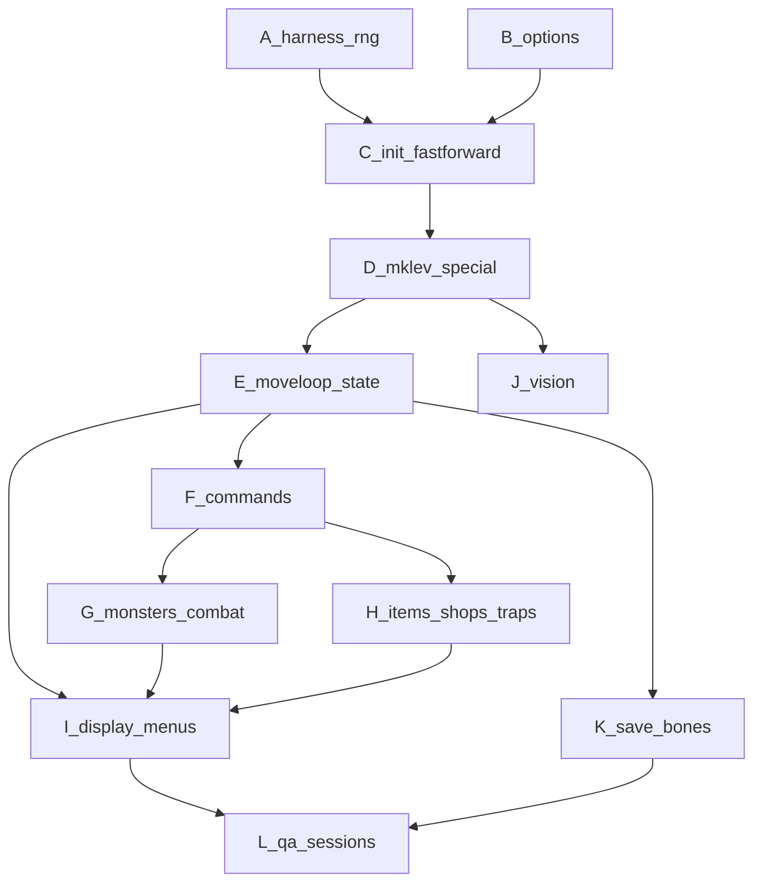

# Global plan: NetHack 5.0 → JavaScript (Teleport)

## How to use this plan

- **North star:** Same PRNG call stream and same terminal frames as the C recorder at every input boundary ([`docs/API.md`](docs/API.md)), with maintainable `js/` for Phase 2 ([`docs/PHASES.md`](docs/PHASES.md)).
- **Execution style:** Tight **parity loop** per subsystem: map C call sites → port → shrink **harness** (`monmove.js`, `moveloop_aux.js`, any leftover `u_init_post_mklev` tail) / remove hardcodes → `bash frozen/score.sh` or one session → fix divergence.
- **Reference code:** Submodule [`nethack-c/upstream/`](nethack-c/upstream/) @ `NetHack-5.0.0_Release`; judge matches **patched clang** build ([`nethack-c/patches/`](nethack-c/patches/), [`nethack-c/README.md`](nethack-c/README.md)).
- **Satellite plans:** When a workstream’s checklist grows too large, copy its section into a new file under [`.cursor/plans/nethack-port/`](.cursor/plans/nethack-port/) (create the directory when needed). Keep the **main plan** as an index with one-paragraph summaries and links to those files.

## Current baseline (repo facts)

- **Contest API:** [`js/jsmain.js`](js/jsmain.js) exports `runSegment`; game object must implement `getScreens`, `getRngLog`, `getCursors` ([`docs/API.md`](docs/API.md)).
- **Frozen:** [`js/isaac64.js`](js/isaac64.js), [`js/terminal.js`](js/terminal.js), [`js/storage.js`](js/storage.js).
- **Startup / init:** [`js/fastforward.js`](js/fastforward.js) is a **stub** (post-mklev delegates to [`js/u_init_post_mklev.js`](js/u_init_post_mklev.js)). Real RNG: [`js/o_init.js`](js/o_init.js), [`js/dungeon_init.js`](js/dungeon_init.js), [`js/role_init.js`](js/role_init.js), large partial [`js/mklev.js`](js/mklev.js), [`js/allmain.js`](js/allmain.js) `newgame` ordering toward C.
- **Moveloop:** [`js/cmd.js`](js/cmd.js) movement + more; per-turn tail still mixes real code with **[`js/monmove.js`](js/monmove.js)** + **[`js/moveloop_aux.js`](js/moveloop_aux.js)** harness until full `allmain.c` / `monmove.c` parity.
- **Score / triage:** **[`.cursor/reports/c-to-js-port-dashboard.md`](.cursor/reports/c-to-js-port-dashboard.md)** + **`node tools/port-score-snapshot.mjs --update-dashboard`**; **`npm run score`** → **1/44** public sessions at full P+S (`seed8000-tourist-starter` pass) — regression check only ([`.cursor/rules/port-from-c-not-score.mdc`](.cursor/rules/port-from-c-not-score.mdc)).
- **Display:** [`js/display.js`](js/display.js) / [`js/vision.js`](js/vision.js) partial.

## Satellite plan files (create as checklists grow)

| File (to add) | Owns |
|----------------|------|
| [`.cursor/plans/nethack-port/01-harness-rng-time.md`](.cursor/plans/nethack-port/01-harness-rng-time.md) | RNG contexts, logging, `runSegment`, segment storage, datetime/moon, animation hook policy |
| [`.cursor/plans/nethack-port/02-init-chargen.md`](.cursor/plans/nethack-port/02-init-chargen.md) | `newgame`, `u_init`, `nethackrc` / [`js/options.js`](js/options.js); finish **`u_init_post_mklev`** / **`ini_inv`** / hardcoded `g.u` cleanup — **`fastforward.js`** startup replay already retired (stub) |
| [`.cursor/plans/nethack-port/03-dungeon-mklev.md`](.cursor/plans/nethack-port/03-dungeon-mklev.md) | `mklev`, branches, special levels / Lua RNG context; mineralize/fill parity inside **`mklev.js`** (old `fastforward_fill_mineralize` name obsolete) |
| [`.cursor/plans/nethack-port/04-monsters-combat.md`](.cursor/plans/nethack-port/04-monsters-combat.md) | `mon`, `mhitu`, `mhitm`, movement, death, corpses |
| [`.cursor/plans/nethack-port/05-items-inventory.md`](.cursor/plans/nethack-port/05-items-inventory.md) | `obj`, invent, pickup/drop, use, charging, containers |
| [`.cursor/plans/nethack-port/06-commands-ui.md`](.cursor/plans/nethack-port/06-commands-ui.md) | `cmd.c` surface, multi-key extended commands, menus, `--More--` |
| [`.cursor/plans/nethack-port/07-display-terminal.md`](.cursor/plans/nethack-port/07-display-terminal.md) | `docrt`, botl, colors/SGR, symset, cursor, pline vs C |
| [`.cursor/plans/nethack-port/08-save-bones-persistence.md`](.cursor/plans/nethack-port/08-save-bones-persistence.md) | Multi-segment sessions, `storage` VFS, bones, topten |
| [`.cursor/plans/nethack-port/09-qa-sessions.md`](.cursor/plans/nethack-port/09-qa-sessions.md) | Session triage workflow, recorder build, regression discipline |

---

## Workstream A — Harness, RNG, and time

**Outcome:** Three RNG channels (core / Lua / display), correct init order, `rngLog` shape matches judge; wall-clock behavior driven by `input.datetime`.

**Tasks / subtasks**

1. **Audit [`js/rng.js`](js/rng.js) vs C** — List every exported helper (`rn2`, `rnd`, `d`, …) and map to C macros; ensure logging toggles match harness expectations.
2. **Clang evaluation order** — Audit JS expressions that call multiple RNG helpers in one statement; split or reorder to mirror left-to-right clang semantics ([`README.md`](README.md)).
3. **Lua / display RNG** — Confirm where Lua levels and hallucination-style code must call distinct streams (see README three-context note); wire wrappers if stubs exist.
4. **`runSegment` contract** — Verify `prevGame`, `storage`, and per-segment aggregation behavior against [`docs/API.md`](docs/API.md) edge cases.
5. **`animationFrame`** — Decide when to call `NethackGame.animationFrame()` for supplemental Anim% without destabilizing screen channel.

*Delegate detail to satellite:* [`.cursor/plans/nethack-port/01-harness-rng-time.md`](.cursor/plans/nethack-port/01-harness-rng-time.md).

---

## Workstream B — Options, `nethackrc`, and parser parity

**Outcome:** `input.nethackrc` drives the same options as C for chargen and runtime messages.

**Tasks / subtasks**

1. **Parse coverage** — Extend [`js/options.js`](js/options.js) for every `OPTIONS=` token exercised by failing sessions (symset, autopickup, msg_window, pet, …).
2. **Defaults** — Match upstream defaults when an option is omitted.
3. **Side effects** — Options that change UI (e.g. symset) must flow into [`js/display.js`](js/display.js) / [`js/game_display.js`](js/game_display.js).

---

## Workstream C — Startup: `newgame`, initialization, kill `fastforward`

**Outcome:** All pre- and post-mklev RNG comes from real ported code; [`js/fastforward.js`](js/fastforward.js) deleted or reduced to zero. *(As of 2026-05-23: file is already a **stub** — remaining work is **`u_init_post_mklev` / `ini_inv` / `mkobj`** and **per-turn** harness in `monmove.js` / `moveloop_aux.js`, not a large `fastforward` replay table.)*

**Tasks / subtasks**

1. **Inventory C startup path** — Trace `allmain.c` / `unixmain.c` / `u_init.c` / `o_init.c` in [`nethack-c/upstream/`](nethack-c/upstream/) and list RNG-consuming functions in order.
2. **`o_init` / shuffles** — Port object and gem shuffle logic; delete matching block from `fastforward_pre_mklev`.
3. **Dungeon struct init** — Port `init_dungeon`, level graph, branch rules; align with [`js/mklev.js`](js/mklev.js) expectations.
4. **`l_nhcore_init`** — Already partially present; verify Lua-facing shuffle parity vs C.
5. **Post-mklev `u_init`** — Port role/race/gender/align, stats, experience, alignment record; remove hardcoded tourist fields in [`js/allmain.js`](js/allmain.js) lines ~49–63.
6. **`ini_inv` / starting inventory** — Port starting equipment logic so gold count and items match traces.
7. **Welcome / preamble messages** — Match `pline` sequence and `--More--` breaks vs sessions.
8. **Delete `fastforward_step` usage** — Once moveloop consumes real RNG for early turns, remove step replay from [`js/allmain.js`](js/allmain.js).

*Delegate detail to satellite:* [`.cursor/plans/nethack-port/02-init-chargen.md`](.cursor/plans/nethack-port/02-init-chargen.md).

---

## Workstream D — Dungeon generation and special levels

**Outcome:** `mklev` + branches + Lua special levels produce identical geography and RNG side effects to C for all sessions.

**Tasks / subtasks**

1. **Diff `mklev.js` vs upstream** — For each major C file (`mklev.c`, `mkmaze.c`, `sp_lev.c`, …), mark ported / missing / approximated.
2. **Branch tables** — Mines, Sokoban, Vlad, Quest, etc.: port `dungeon.def` logic and branch linkage RNG.
3. **`fastforward_fill_mineralize`** — Replace with real `fill_room`, mineralize, monster/object placement from C.
4. **Lua special levels** — Embed or interpret Lua as upstream does; ensure **Lua RNG context** logging matches ([`nethack-c/patches/`](nethack-c/patches/)).
5. **Stairs and ladders** — Up/down/special transfers must match dungeon revision and screen updates.

*Delegate detail to satellite:* [`.cursor/plans/nethack-port/03-dungeon-mklev.md`](.cursor/plans/nethack-port/03-dungeon-mklev.md).

---

## Workstream E — Core moveloop and global game state

**Outcome:** `moveloop_core` parity: time advances, hunger (if applicable), multi-turn actions, environmental updates, death handling.

**Tasks / subtasks**

1. **Port `allmain.c` loop structure** — Separate “get command” vs “run command” vs “world reacts” phases matching C order of RNG draws.
2. **`gstate` / `struct you` / `struct level`** — Evolve [`js/gstate.js`](js/gstate.js) and [`js/game.js`](js/game.js) toward upstream field completeness as needed by failing sessions.
3. **Death, `#quit`, endgame** — Match prompts and score flow for multi-segment sessions later.

---

## Workstream F — Command set (`cmd.c` and friends)

**Outcome:** Every keystroke in recorded sessions maps to correct behavior and messages.

**Tasks / subtasks**

1. **Command taxonomy** — Build a table: key / extended / direction → C entry (`rhack`, `doextcmd`, …).
2. **Movement extensions** — Running, `g` travel, diagonals, bump-attack already partially there; add fight, displacement, traps.
3. **Item commands** — `i`, `d`, `q`, `r`, `w`, `W`, `T`, `P`, etc., each as sub-port with tests against first diverging session.
4. **Meta** — `#`, `!`, shell escape disabled or parity-stub per sandbox rules.
5. **Count prefix and repeat** — `10s` style if sessions use it.

*Delegate detail to satellite:* [`.cursor/plans/nethack-port/06-commands-ui.md`](.cursor/plans/nethack-port/06-commands-ui.md).

---

## Workstream G — Monsters and combat

**Outcome:** Monster creation, placement, AI, attacking, damage, death, corpses, scheduling all match C RNG and screens.

**Tasks / subtasks**

1. **New modules** — Introduce `js/mon.js`, `js/dog.js` (or split by upstream file boundaries) instead of growing unrelated files past readability.
2. **Monster struct** — Fields needed for combat, inventory, movement flags.
3. **Hostile movement** — Pathing, respect for corridors, conflict resolution order.
4. **Combat RNG** — To-hit, damage, armor, resistances, passive attacks.
5. **Monster death** — Corpse generation, tinning, globs; RNG order vs `do_monsters`.

*Delegate detail to satellite:* [`.cursor/plans/nethack-port/04-monsters-combat.md`](.cursor/plans/nethack-port/04-monsters-combat.md).

---

## Workstream H — Items, shops, traps, dungeon features

**Outcome:** Object system rich enough for sessions: shops, price ID, traps, doors, containers, altars, fountains, sinks, etc.

**Tasks / subtasks**

1. **`obj` / `invent` port slices** — Pickup, stack, merge, BUC, erosion.
2. **Shopkeeper logic** — Billing, stealing, anger, inventory generation.
3. **Traps** — Creation, arming, triggering, messages.
4. **Static dungeon features** — Doors, iron bars, sinks, graves.

*Delegate detail to satellite:* [`.cursor/plans/nethack-port/05-items-inventory.md`](.cursor/plans/nethack-port/05-items-inventory.md) (and fold traps/shops into same or `03` if preferred).

---

## Workstream I — Display, terminal, menus

**Outcome:** Byte-identical serialized frames at boundaries after canonicalization rules in [`docs/API.md`](docs/API.md).

**Tasks / subtasks**

1. **Map rendering** — `newsym`, `mapglyph`, dark / lit / remembered tiles vs C.
2. **Status line (`botl`)** — HP, Pw, AC, Au, exp, dungeon level, time — field order and formatting.
3. **Message line** — `pline`, multi-line, continuation prompts.
4. **Menus** — Inventory, `#`, spell pick, direction prompts: cursor position and redraw rules.
5. **SGR / color** — Match contest canonicalization (forgiving spaces) without masking real mismatches.

*Delegate detail to satellite:* [`.cursor/plans/nethack-port/07-display-terminal.md`](.cursor/plans/nethack-port/07-display-terminal.md).

---

## Workstream J — Vision

**Outcome:** [`js/vision.js`](js/vision.js) matches `vision.c` for light, dark, remembered map, and elves-infravision style cases exercised by sessions.

**Tasks / subtasks**

1. **Light sources** — Player, monsters, lamps, lava.
2. **Recalc triggers** — When `vision_recalc` must run relative to moves and dungeon edits.

---

## Workstream K — Save, restore, bones, multi-segment sessions

**Outcome:** Correct persistence via [`js/storage.js`](js/storage.js) API across segments in one session file.

**Tasks / subtasks**

1. **Serialize `you` + levels + `obj` chains** — Match upstream save format semantics (binary layout can differ; **observable** state and RNG after restore must match).
2. **Bones** — File naming, level exclusion, loading bones on new game.
3. **Topten / record** — If sessions touch scoreboard files.

*Delegate detail to satellite:* [`.cursor/plans/nethack-port/08-save-bones-persistence.md`](.cursor/plans/nethack-port/08-save-bones-persistence.md).

---

## Workstream L — QA, scoring, and Phase 1 freeze readiness

**Outcome:** Reliable loop to climb from partial to full passes without overfitting public sessions ([`.cursor/rules/teleport-contest.mdc`](.cursor/rules/teleport-contest.mdc)).

**Tasks / subtasks**

1. **Session triage list** — Sort public sessions by first divergence index; attack easiest wins first.
2. **Recorder cross-check** — Optional local C build ([`nethack-c/build-recorder.sh`](nethack-c/build-recorder.sh)) for new traces.
3. **RNG-first debugging** — On mismatch, binary-search first RNG divergence, then screen.
4. **Held-out mindset** — After changes, ensure logic is general (no session literals).
5. **Phase 1 tag hygiene** — Before Nov 29, 2026 freeze ([`docs/PHASES.md`](docs/PHASES.md)): clean module boundaries, naming, comments at architectural seams for Phase 2 diff penalty.

*Delegate detail to satellite:* [`.cursor/plans/nethack-port/09-qa-sessions.md`](.cursor/plans/nethack-port/09-qa-sessions.md).

---

## Suggested ordering (dependencies)

---

## Immediate next steps (first sprint)

1. Author **satellite file** [`.cursor/plans/nethack-port/01-harness-rng-time.md`](.cursor/plans/nethack-port/01-harness-rng-time.md) with a checklist derived from Workstream A.
2. Author [`.cursor/plans/nethack-port/02-init-chargen.md`](.cursor/plans/nethack-port/02-init-chargen.md) mapping each `fastforward_pre` / `post` region to C functions and proposed `js/` modules.
3. Run `bash frozen/score.sh`, pick **one** session (e.g. `seed8000-tourist-starter`), record first RNG and first screen divergence after any change — use as the sprint exit criterion.
