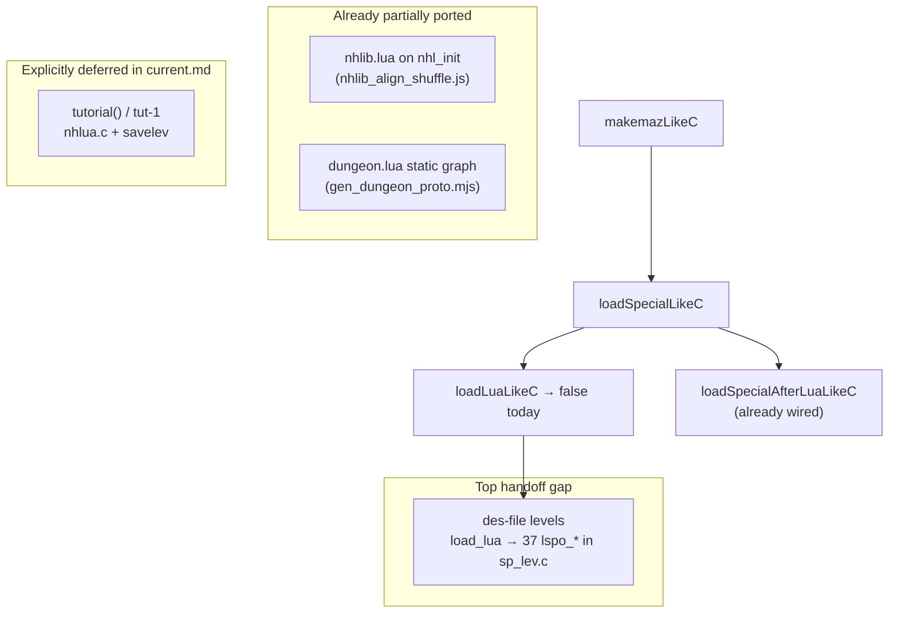

# NHL / `load_lua` strategy and next port slices

## Session preflight (your workflow request)

| Check | Status |
|-------|--------|
| Unpushed commits | **None** — `main...origin/main` (clean sync) |
| Score ≥ 2/44 for push | **Yes** (2/44: `seed0077`, `seed8000`) |
| Re-run `npm run score` | **Skip** until there is a new commit to push |

**Git push:** not needed this turn.

---

## What “big Lua” actually is (scope guard)

Three separate Lua surfaces—do not conflate them:

| Surface | C anchor | JS today | Size |
|---------|----------|----------|------|
| **des-file levels** | [`nethack-c/upstream/src/sp_lev.c`](nethack-c/upstream/src/sp_lev.c) `lspo_*` + [`nethack-c/upstream/src/nhlua.c`](nethack-c/upstream/src/nhlua.c) `load_lua` | [`js/mklev.js`](js/mklev.js) `loadLuaLikeC` **always returns false** → post-lua chain never runs for des levels | ~37 `des.*` C bindings; **128** `.lua` under `dat/`; scripts call `selection.*`, `shuffle`, `math.random`, loops |
| **nhlib** | `dat/nhlib.lua` | [`js/nhlib_align_shuffle.js`](js/nhlib_align_shuffle.js) (align shuffle only) | Small, incremental |
| **dungeon graph** | `dat/dungeon.lua` | [`js/dungeon_proto.js`](js/dungeon_proto.js) via [`tools/gen_dungeon_proto.mjs`](tools/gen_dungeon_proto.mjs) | **Done pattern** for *data*, not executable des |
| **Tutorial** | `nhlua.c` `tutorial()` | [`js/tutorial_branch.js`](js/tutorial_branch.js) stub | **Deferred** per [`c-to-js-port-current.md`](.cursor/reports/c-to-js-port-current.md) |

**Critical blocker:** [`loadLuaLikeC`](js/mklev.js) stub means `makemazLikeC` never loads `minetn-*.lua`, quest files, etc.—procedural maze runs instead, so Mines/special-level RNG diverges from C whenever those paths execute.

**RNG note:** README requires **three PRNG contexts** (core / Lua / display). [`js/rng.js`](js/rng.js) currently documents “only core context” and aliases `lua_d = d`. Before real `load_lua`, add a **Lua ISAAC context** and route `des`/`nh` Lua draws through it with the same log tagging the recorder uses ([`nethack-c/patches/004-rng-log-lua-context.patch`](nethack-c/patches/004-rng-log-lua-context.patch)).

---

## Should Lua come before other work?

**Dual-track (recommended)—not either/or:**

| Track | Why | Expected score impact |
|-------|-----|------------------------|
| **A — Strategic (dashboard)** | **TTY chargen** (`wintty.c` / `role.c`) — 11 sessions lack embedded `OPTIONS` identity | **Higher** short-term pass count |
| **B — Handoff top step (C dungeon)** | **`load_lua` + des API** — correct special-level generation when `makemaz` resolves a `.lua` protofile | **Lower** until sessions reach Mines/branches; **essential** for C-faithful dungeon graph |

**Do not** attempt full `nhlua.c` (~3.1k lines) or all 128 scripts in one session—that invites hallucinated APIs.

**Do not** defer Track B indefinitely: without `load_lua`, [`loadSpecialAfterLuaLikeC`](js/mklev.js) (flip, wallify, ensure_way_out, premap) never runs for des levels even though much of it is already ported in [`js/sp_lev_load.js`](js/sp_lev_load.js).

---

## Recommended slice order (minimize context overload)

### Slice 1 — `flip_level` `extras` (handoff item 1b, ~1 session)

**C:** [`sp_lev.c`](nethack-c/upstream/src/sp_lev.c) `flip_level(..., extras=TRUE)` — `#wizfliplevel`: punished ball/chain, `flip_vault_guard`, migrating mons (`gm.migrating_mons`), priest/shop coords.

**JS:** [`js/sp_lev_load.js`](js/sp_lev_load.js) — today `flipLevelLikeC` **returns early when `extras`** (line ~498). Remove that guard and port the `extras` blocks incrementally.

**Why first:** Bounded C surface, no Lua VM, keeps **2/44** regression green; unblocks `des.flip_level` binding later.

### Slice 2 — NHL Phase 0: infrastructure (no full VM yet)

1. **`js/nhl_rng.js`** (new): Lua-context ISAAC; `nhlRn2` / `nhlRandom` mirroring `nhl_rn2` / `nhl_random` in C; log lines compatible with harness.
2. **`js/nhl_builtins.js`** (new): Port nhlib helpers used by des scripts on load—`shuffle`, `percent` (grep `nhlib.lua` + `dat/nhlib.lua`); extend pattern from [`nhlib_align_shuffle.js`](js/nhlib_align_shuffle.js).
3. **`js/des_api.js`** (new): Start **`lspo_*`** in **dependency order** (read **one** C function per commit):
   - `level_flags`, `level_init`, `map` (static ASCII map in `minetn-1.lua`)
   - then `region` / `levregion` / `teleport_region`, `feature`, `door`, `terrain`, `replace_terrain`
   - then `object`, `monster`, `wallify`, `finalize_level`
4. **Wire** [`loadLuaLikeC`](js/mklev.js): `nhl_init` → load `nhlib.lua` → load protofile → `nhl_done`; return **true** only when script completes without error.

**VM choice (decide in Slice 2, document in notes file):**

| Option | Pros | Cons |
|--------|------|------|
| **Vendored Fengari** (pure JS, ES module, no WASM) | Runs real `.lua`; matches control flow/loops | Large vendored tree; sandbox APIs still need JS bindings |
| **Vertical transpile `minetn-1.lua` only** | Smallest diff for one level | Does not generalize; easy to “session-shape” if not careful |
| **Hybrid** | Fengari for execution + hand-ported `des.*` in JS | Best long-term; more upfront wiring |

**Recommendation:** **Hybrid** — Fengari (or equivalent **plain JS** Lua 5.4) for script control flow; implement `des.*` as JS functions calling existing [`mklev.js`](js/mklev.js) / [`selection.js`](js/selection.js) primitives. Follow the precedent of [`tools/gen_dungeon_proto.mjs`](tools/gen_dungeon_proto.mjs) only for **static data**, not for runtime des scripts.

### Slice 3 — First vertical level: `minetn-1.lua`

**Why:** Referenced by ransacked/stolen-booty path; representative des script ([`nethack-c/upstream/dat/minetn-1.lua`](nethack-c/upstream/dat/minetn-1.lua)) using `selection.floodfill`, `shuffle(place)`, `math.random` loops, `des.object`/`des.monster`.

**Exit criteria for this vertical:** `loadSpecialLikeC(g, 'minetn-1')` returns true; `loadSpecialAfterLuaLikeC` runs; Lua-context RNG log segment matches C for a **single** recorded makemaz invocation (use `tools/` or one failing session as **locator**, not as pasted answers).

### Slice 4+ — Expand des API and levels

- Port remaining `lspo_*` from [`sp_lev.c` `nhl_functions[]`](nethack-c/upstream/src/sp_lev.c) (~lines 6379–6416).
- Extend [`js/selection.js`](js/selection.js) for Lua `selection.area`, `&`, `rndcoord` (C `selvar.c` / NHL selection registration).
- Add levels as sessions require (quest `*-strt.lua`, soko, etc.)—**one level per changelog row** when possible.

### Parallel track — Chargen (score ROI)

When not in a dungeon slice, continue [`c-to-js-port-current.md`](.cursor/reports/c-to-js-port-current.md) **strategic priority**: `wintty.c` / `role.c` pickers for sessions without `OPTIONS=name:` / `role:`.

Handoff items **2–3** (`mon_arrive` worm/`initworm`, `goto_level` savelev tail) are **medium slices** that can interleave between NHL Phase 0 and Phase 1—good if you need a break from Lua.

---

## Anti-hallucination / context discipline

Add a **thin tracker** (new file, ~80 lines, not a second progress doc):

**[`.cursor/reports/nhl-port-notes.md`](.cursor/reports/nhl-port-notes.md)** — maintain:

- Checklist of 37 `des.*` bindings (name → C `lspo_*` line → JS status)
- Checklist of `nh.*` / selection Lua methods actually seen in **target** scripts
- “Read this slice” pointers (max 2 C functions + 1 `.lua` file per task)
- Sessions/depth that first hit des load (from score triage)

**Per slice rules:**

- Read C with **explicit path** `rg` / `read_file` on `nethack-c/upstream/` (nested submodule).
- Never paste from `sessions/*.session.json` into port code.
- One **`git commit`** per slice: `js/` + `c-to-js-port-current.md` + one changelog row; `npm run score` when RNG/screens may change; push only if ahead of origin and score still ≥ 2/44.

---

## What this plan explicitly defers

- Full **tutorial** / `tut-1` / `savelev` / `gmst_*` Lua ([`c-to-js-port-current.md`](.cursor/reports/c-to-js-port-current.md) deferred backlog)
- Porting all **128** `dat/*.lua` before a vertical proof
- Embedding Lua for **quest pager** / menu NHL APIs (`nhl_menu`, `getlin`, …)—chargen is C tty first
- Score-chasing via `fastforward.js` / harness without C call sites

---

## After you approve: first execution session

1. Implement **Slice 1** (`flip_level` extras) *or* **Slice 2** (NHL Phase 0) if you prefer to start Lua infrastructure immediately.
2. Refresh [`c-to-js-port-current.md`](.cursor/reports/c-to-js-port-current.md) + one row in [`c-to-js-port-changelog-archive.md`](.cursor/reports/c-to-js-port-changelog-archive.md).
3. `npm run score` if RNG touched.
4. `git commit` (user rules allow commit when executing the port workflow).
5. `git push` only if branch is ahead and score ≥ 2/44.
