# Port progress retrospective and doc refresh

## Why this is worth doing now

The repo already has a **good doc split** ([`.cursor/reports/c-to-js-port-current.md`](.cursor/reports/c-to-js-port-current.md) for handoff, [`c-to-js-port-remaining.md`](.cursor/reports/c-to-js-port-remaining.md) for gaps, changelog archive for history). Several **canonical files are materially stale** relative to the tree:

| Claim in older docs | Reality today (2026-05-23) |
|---------------------|----------------------------|
| [`js/fastforward.js`](js/fastforward.js) replays “hundreds” of startup draws | **~26 lines** — `fastforward_pre_mklev()` is empty; post-mklev delegates to [`js/u_init_post_mklev.js`](js/u_init_post_mklev.js) |
| Startup is mostly harness | **Real C landed** in recent slices: [`js/o_init.js`](js/o_init.js), [`js/dungeon_init.js`](js/dungeon_init.js), [`js/role_init.js`](js/role_init.js), post-mklev order in [`js/allmain.js`](js/allmain.js) |
| [`c-to-js-port-progress.md`](.cursor/reports/c-to-js-port-progress.md) “Generated: 2026-05-16” | Still describes fastforward as dominant debt; understates May 23 init/monmove work |
| [`.cursor/plans/nethack-port/02-init-chargen.md`](.cursor/plans/nethack-port/02-init-chargen.md) checklists | Still list peeling `fastforward_fill_mineralize` / large replay blocks that no longer exist |
| Roadmap “Current baseline” in [`.cursor/plans/nethack_js_port_roadmap_19a4defd.plan.md`](.cursor/plans/nethack_js_port_roadmap_19a4defd.plan.md) | Says `allmain` “relies on fastforward for pre/post-mklev” — mostly false now |

**Score (regression only, not the goal):** `npm run score` → **1/44** (only [`seed8000-tourist-starter`](sessions/seed8000-tourist-starter.session.json) full pass). That is expected while porting C depth: many commits improved **seed8000** to 3130/3130 without unlocking other sessions.

```mermaid
flowchart LR
  subgraph done [Mostly real C now]
    oinit[o_init shuffle]
    dungeon[init_dungeons]
    roleinit[role_init]
    mklev[mklev makelevel]
    seed8000[seed8000 moveloop tail]
  end
  subgraph harness [Still session-shaped]
    monmove[monmove stepNum geometry]
    moveloop_aux[moveloop_aux rn2 tails]
    uinit_rng[u_init_post_mklev remainder]
    ini_inv[ini_inv_stub not mkobj]
  end
  subgraph missing [Dominant gaps]
    chargen_tty[wintty chargen menus]
    invent[game.invent + mkobj]
    dochug[full dochug movemon]
    combat[uhitm AC damage]
  end
  done --> harness
  harness --> missing
```

---

## Phase 1 — Automated snapshot (facts, not prose)

Add a small **read-only** maintainer script (no contest `js/` behavior change):

- **File:** [`tools/port-score-snapshot.mjs`](tools/port-score-snapshot.mjs) (or extend an existing tool if one fits)
- **Behavior:** run `bash frozen/score.sh`, parse `__RESULTS_JSON__`, emit:
  - pass count and commit SHA
  - table: session → RNG matched/total, screens matched/total, first-fail index if available
  - bucket tags: `full-pass`, `rng>50%`, `screens>0`, `early-diverge` (&lt;500 RNG)
- **Output:** overwrite a generated section in a new dashboard file (see Phase 2), or write `frozen/port-score-snapshot.json` for the dashboard to include

This keeps the retrospective **repeatable** after each milestone without hand-editing 44 rows.

---

## Phase 2 — New “dashboard” doc (single page of truth)

Create **[`.cursor/reports/c-to-js-port-dashboard.md`](.cursor/reports/c-to-js-port-dashboard.md)** (~150–250 lines, maintained lightly):

1. **As-of header** — date, git SHA, score X/44, one-line strategic focus (from current handoff).
2. **Milestone matrix** (from [`c-to-js-port-remaining.md` §5](.cursor/reports/c-to-js-port-remaining.md)) with statuses:

   | Milestone | Status | Evidence |
   |-----------|--------|----------|
   | Shrink `fastforward.js` | **Mostly done** | file is stub; real `o_init` / `dungeon_init` / `role_init` |
   | `game.invent` + `mkobj` + `ini_inv` | **Not started** (stub) | `ini_inv_stub.js`, no invent chain |
   | Real `movemon` / `dochug` | **Partial / risky** | real `distfleeck`/`m_move` slices but heavy `stepNum` in [`js/monmove.js`](js/monmove.js) (~368 lines) |
   | `moveloop_aux` tail | **Partial** | real `gethungry`/`exerchk`; harness `rn2` blocks remain (~191 lines) |
   | Chargen TTY | **In progress** | `chargen_tty.js`, `seed0077` 1613/3242, `seed0900` 966/2983 |
   | Combat pipeline | **Stub** | `attack.js` |
   | Branches / `sp_lev` | **Stub** | `sp_levchn.js` |
   | Save/bones | **Out of scope for now** | frozen `storage.js` API only |

3. **Session heatmap** — generated table from Phase 1 script (not hand-maintained).
4. **Harness inventory** — what still replays vs what peeled (link to [`js/fastforward.js`](js/fastforward.js), [`js/monmove.js`](js/monmove.js), [`js/moveloop_aux.js`](js/moveloop_aux.js)).
5. **“Do not forget”** — contest integrity bullets (port from C, frozen files, submodule search tips) — **short**, link out to rules.

**Do not** duplicate the changelog archive or the long “what is ported” essay from [`c-to-js-port-progress.md`](.cursor/reports/c-to-js-port-progress.md).

---

## Phase 3 — Rewrite / trim stale docs (targeted, not a full rewrite)

### 3.1 [`c-to-js-port-progress.md`](.cursor/reports/c-to-js-port-progress.md)

- Replace the opening **executive summary** (lines ~16–24) to state:
  - fastforward is **nearly retired** for startup;
  - dominant debts are **`monmove`/`moveloop_aux` harness**, **`ini_inv`/`mkobj`/`game.invent`**, **TTY chargen**, **combat**;
  - score 1/44 is not a regression of port direction.
- Add prominent link: **“For current numbers and milestones, see [`c-to-js-port-dashboard.md`](c-to-js-port-dashboard.md).”**
- Keep §3 “What is ported” as deep reference but add a **“Last verified”** date; avoid duplicating May-23 changelog detail (archive owns that).

### 3.2 [`c-to-js-port-remaining.md`](.cursor/reports/c-to-js-port-remaining.md)

- Update §1 table row **“Startup RNG bridge”**: fastforward is no longer “hundreds of draws”; call out **`u_init_post_mklev.js`** + remaining **`ini_inv`** / rogue `u_init_role` RNG as the bridge.
- Add explicit **warning** under monster turn: recent `monmove` work is **geometry/stepNum-accurate for seed8000** — milestone “real dochug” still requires peeling `stepNum` gates, not adding more session-specific finders.

### 3.3 [`c-to-js-port-current.md`](.cursor/reports/c-to-js-port-current.md)

- Keep as thin handoff; after retrospective, only:
  - refresh “Last slice” if nothing new shipped;
  - **reorder “Next steps”** into 3 bullets max above the fold (chargen/RNG → invent/mkobj → generalize monmove);
  - link dashboard at top.

### 3.4 Satellite plans + roadmap index

For each file under [`.cursor/plans/nethack-port/`](.cursor/plans/nethack-port/):

- Add **Status: as of 2026-05-23** block at top: Done / Partial / Not started (5–10 bullets).
- **02-init-chargen.md:** mark pre-mklev fastforward items **done**; shift checklist to `u_init_role` / `ini_inv` / tty menus / peel `u_init_post_mklev`.
- **03-dungeon-mklev.md:** note vault `rnd_rect` loop and mineralize slices landed; list remaining mklev gaps (dig_corridor, `setgemprobs`, legacy otyp literals).
- **04-monsters-combat.md:** document seed8000 moveloop progress vs general `dochug` gap.
- **09-qa-sessions.md:** point to dashboard + snapshot script for triage.

Update [`.cursor/plans/nethack_js_port_roadmap_19a4defd.plan.md`](.cursor/plans/nethack_js_port_roadmap_19a4defd.plan.md) **“Current baseline”** section to match dashboard (fastforward stub, seed8000 pass, harness locations).

### 3.5 Entry points

- [`.cursor/README.md`](.cursor/README.md): add dashboard to “Read first” list (between current and remaining).
- [`.cursor/prompts/continue-nethack-port.md`](.cursor/prompts/continue-nethack-port.md): optional one-liner “after large milestone, run `node tools/port-score-snapshot.mjs` and skim dashboard.”
- [`.cursor/rules/nethack-port-progress.mdc`](.cursor/rules/nethack-port-progress.mdc): mention dashboard for retrospective/score tables.

---

## Phase 4 — Adapt execution priorities (plan content, not code yet)

Reconcile handoff with C milestones (no score-chasing):

**Tier A — unlock many sessions (chargen + invent)**

- [`seed0077`](sessions/seed0077-rogue-chargen.session.json): rogue `u_init_role` ~1606 (`rn2(2)` vs `rn2(50)`), `consumeRogueHumanIniInvUinitRoleRngLikeC` / `mksobj_init` (already top of current.md).
- Interactive chargen: `wintty.c` / `role.c` pickers for sessions **without** embedded OPTIONS identity (11 sessions per current.md).
- Begin **`ini_inv` + `mkobj`** wiring to `game.invent` (unblocks skills, traps, combat prep) — aligns with remaining.md §5 step 2.

**Tier B — generalize moveloop (peel harness carefully)**

- Continue **C-faithful** `monmove.c` slices, but each slice should **remove** a `stepNum` / coordinate special-case when `fmon` order + `dochug` logic explains seed8000 without it.
- `moveloop_aux`: replace `pre`/`post_moveloop82_exercise` replay with real `allmain.c` tail only when draw **counts** match on exercised paths.

**Tier C — deferred backlog** (unchanged)

- Tutorial — gated on [`docs/plans/tutorial-port-gate.md`](../../docs/plans/tutorial-port-gate.md) MD-1…MD-7 (Lane E when open); full trap/zap/shop long tail stays Tier C long tail.

**Explicit anti-patterns to record in dashboard**

- New `stepNum` finders without a C call-site justification.
- Growing harness to fix `seed0077` without porting `u_init.c` paths.
- Treating “screens 0/N” sessions as display bugs before RNG alignment at first divergence.

---

## Git — commit at each meaningful slice

**User policy (2026-05-23):** commit freely at each meaningful step/slice during execution (same intent as [`.cursor/prompts/continue-nethack-port.md`](.cursor/prompts/continue-nethack-port.md) and [AGENTS.md](AGENTS.md)). Do **not** batch the whole retrospective into one commit at the end.

Suggested **2–3 commits** (conventional messages, focus on *why*):

| After | Files | Message shape |
|-------|--------|----------------|
| Phase 1 + 2 | `tools/port-score-snapshot.mjs`, optional `frozen/port-score-snapshot.json`, `.cursor/reports/c-to-js-port-dashboard.md` | `chore(tools): add port score snapshot and dashboard` |
| Phase 3 (reports) | `c-to-js-port-progress.md`, `c-to-js-port-remaining.md`, `c-to-js-port-current.md`, entry-point links | `docs(port): refresh progress docs for post-fastforward baseline` |
| Phase 3 (plans) | `.cursor/plans/nethack-port/*.md` status blocks, roadmap baseline | `docs(plans): add 2026-05-23 status to satellite port plans` |

Run `npm run score` before the first dashboard commit (or refresh dashboard numbers in a follow-up commit if score drifts). Include `.cursor/reports/` in the same commit as the doc it describes.

---

## Phase 5 — Execution order (when approved)

1. Run snapshot script → fill dashboard → **commit** (slice 1).
2. Edit reports: dashboard cross-links, remaining/progress/current, README/rules/prompt → **commit** (slice 2).
3. Satellite plan status blocks + roadmap baseline → **commit** (slice 3).
4. Optional: append one changelog-archive row only if a **port** slice shipped in the same session; pure doc refresh does not need an archive row.

---

## What we are *not* doing in this retrospective

- No changes to frozen [`js/isaac64.js`](js/isaac64.js), [`js/terminal.js`](js/terminal.js), [`js/storage.js`](js/storage.js).
- No port code slices (those stay in normal “continue port” sessions).
- No memorizing session traces into `fastforward` / `monmove` harness.
- No replacing [`c-to-js-port-changelog-archive.md`](.cursor/reports/c-to-js-port-changelog-archive.md) — it remains the dated audit trail.
