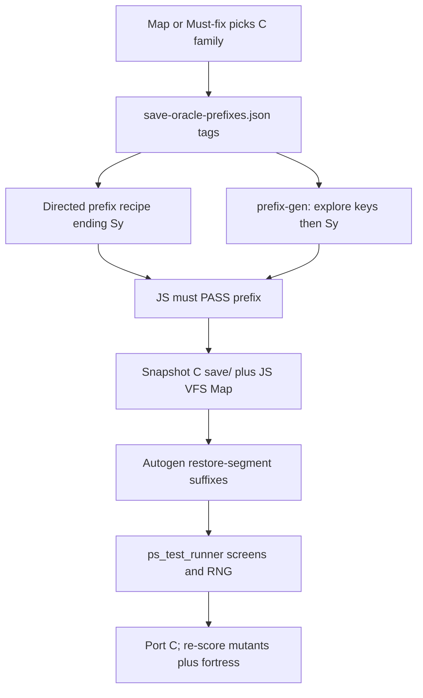

# Save-prefixed oracle in the porting loop

Authority for this take: operator wants **constitution / playbook / runbook / loop prompt / Cursor rules** updated so porting uses **autogenerated savestates** as the JS↔C screen+RNG comparison. Frozen overlays, public `sessions/manifest.json`, and upstream C stay untouchable.

Source notes (not work lists): [docs/proposals/2026-08-30-save-prefixed-oracles-and-snapshot-fork.md](docs/proposals/2026-08-30-save-prefixed-oracles-and-snapshot-fork.md) (self-review amended landing), C3 spec in [docs/proposals/2026-08-28-differential-session-fuzzing-oracle.md](docs/proposals/2026-08-28-differential-session-fuzzing-oracle.md). Ledger D-1694…D-1699 is the persistence prerequisite.

## What changes vs what does not

**Does not change:** work picker. `CURRENT.md` primary / `LOOP-QUEUE.md` Must-fix then Open still chooses the C family. Raw first-diff one-liners never become Open/Must-fix by themselves.

**Does change:** the **falsifier** for a tagged omit is no longer “hope a public session hits it” or a hand canary only. The agent (or operator) runs a save-oracle that (1) obtains a **green** prefix ending `Sy`, (2) snapshots C `save/` and JS VFS **separately**, (3) autogenerates short restore-segment mutants, (4) scores screens+RNG with the frozen comparator. The session is an **observation**; the fix still cites pinned C.



## Hard rules (write these into Constitution §1, not only a proposal)

- C `save/` is NHFILE; JS is frozen VFS JSON. **Never copy one into the other.**
- Snapshot **after prefix `Sy`**, before any restore (`try_restore_save` / C `delete_savefile` wipe the save).
- **Fork only from a prefix JS already PASSes** (RNG + screen + cursor + `strict-output-check` on that private session). Forking a red prefix measures prefix debt.
- Mutant is a full [`js/jsmain.js`](js/jsmain.js) `runSegment` (dorecover, `welcome(false)`, `check_special_room`, `moveloop_preamble(true)`). Not a mid-moveloop inject.
- Copy the **whole isolated HACKDIR `save/`** from the prefix worker (path ≤ 128 chars). Do not glob the developer’s main install. Snapshot **`save/` only** (bones are a later take).
- `--restore-seed` explicit per fork family (do not silently reuse ledger `99999` or the prefix seed without saying so). Same datetime as prefix unless the omit *is* moon/Friday.
- M2 check in the **wrapper**, not scored `js/`: after restore, no off-level `TIMER_OBJECT` on `_timer_base`.
- Failed timer/light relink still **throws** in production.
- Wait-then-save-then-`<` does **not** test catchup (C `savelev` writes `svm.moves`; restamp zeros elapsed). Catchup-after-restore = restore, then wait, then `<`.
- Never `sessions/manifest.json`. Cadence stays the public 44.
- Mechanical coverage (`Unknown command` / direction / extended command / role-init throw) is discarded. Named-omit bucket: only against a **named** `c-js-map` / module-header deferral.
- C3 consumption: human/audit may promote a **minimized** hit + pinned C locus to Must-fix. The port iteration that is *already working that locus* uses the oracle as focused verify — it does not shop the dashboard for a new peel.

## Cluster sequence (independently green)

One branch, seven commits. Do not start Cluster 1 code until Cluster 0 is green. Do not start forking (Cluster 2) until a fixture prefix PASSes.

### Cluster 0 — Multi-segment `rng-diff`

File: [`scripts/rng-diff.mjs`](scripts/rng-diff.mjs) (today concatenates C rng but `runSegment`s only `segments[0]`).

- Share storage across segments like [`frozen/ps_test_runner.mjs`](frozen/ps_test_runner.mjs) (~310–341).
- Default remains segment 0. `--all-segments` prints first miss, owning segment, local index, C `@ file:line`.
- Fixture: [`private-sessions/ledger-seed0015-valk-descend-save-ascend.session.json`](private-sessions/ledger-seed0015-valk-descend-save-ascend.session.json) must report RNG OK (26/26 already).

### Cluster 1 — Snapshot + one-mutant fork (no autogen yet)

New [`scripts/save-oracle.mjs`](scripts/save-oracle.mjs) (Node operator tooling; **not** imported from scored `js/`).

Commands:

- `snapshot --prefix <recipe.json>` — record C seg0 (`wipeSave: true`); JS `runSegment` with shared Map; persist `{ cSaveDir, vfsEntries, nethackrc, datetime, restoreSeed, prefixId }` under `.cache/save-oracle/` (gitignored).
- `replay --snapshot <id> --moves "< "` — copy isolated `save/`, record one restore segment; JS clone Map then `runSegment`; score via [`scripts/lib/fuzz-compare.mjs`](scripts/lib/fuzz-compare.mjs) (import, do not re-derive).

Fixture: ledger prefix (seg0 only, already ends `Sy`). Replay `"< "` must match the existing two-segment session’s seg1 metrics (8472/8472 was the full session; compare seg1 slices).

Isolated HACKDIR copies under `/tmp/nhso/wN`, same `RECORD_MIN_STEPS` / 128-char rule as C3.

### Cluster 2 — Autogenerate restore-segment mutants

Reuse [`scripts/data/fuzz-alphabets.json`](scripts/data/fuzz-alphabets.json) `explore` (add a **fork** alphabet that includes `<` `>` `.` `s` `,` and modest `a`/`o`/`i` — **not** wizard `#` unless the omit is wizmode).

- `save-oracle.mjs fork --snapshot <id> --n 8 --seed <n>` writes recipes under `.cache/save-oracle/` only.
- Vacuous floor: steps ≥ `moves.length+1`.
- Triage: C3 buckets (mechanical / named-omit / fidelity). Print dashboard; **do not** write Open rows.
- Minimize with existing [`scripts/fuzz-oracle.mjs`](scripts/fuzz-oracle.mjs) `minimize` on the restore suffix, then optional copy into `private-sessions/` (never manifest).

Short prefixes: if prefix `moves.length < 80`, skip snapshot and tell the operator to use a two-segment hand recipe (self-review S4). Ledger prefix is long enough.

### Cluster 3 — Autogenerate prefixes (the savestates)

Explore alphabet has `>` but **no `S`**. Prefix-gen must **append** `Sy` (and a More-dismiss space if needed), not hope a random walk saves.

- `save-oracle.mjs prefix-gen --mode explore --n 4` — chargen+explore keys + `Sy`; record; JS score; **snapshot only if PASS**; otherwise log as prefix-debt (do not fork).
- Directed library in [`scripts/data/save-oracle-prefixes.json`](scripts/data/save-oracle-prefixes.json): `{ id, recipe, tags: ["getlev","stairs","pet"], restoreSeed }`. Seed the library with:
  - existing ledger seg0 (getlev / pet)
  - existing trap-same-floor (same-dlvl restore)
  - **shop** and **trap-ledger** and **catchup-after-restore** recorded **red first** on current HEAD (Stage C from the proposal). Shop staying red is expected until `buy_container` & friends land; those Open rows use the **red two-segment recipe** as focused verify until the prefix is green enough to fork.

### Cluster 4 — Authority docs and Cursor rule

This cluster **is** allowed to edit files loop porters normally cannot. After it lands, porters go back to not rewriting them.

| File | Delta |
|---|---|
| [docs/CONSTITUTION.md](docs/CONSTITUTION.md) §1 | Save-prefixed private recordings are acceptance **observations** for tagged omits; never specs; never public manifest. NHFILE≠JSON. Fork only from green prefixes. |
| [docs/CONSTITUTION.md](docs/CONSTITUTION.md) §10 | Port packet must name the save-oracle command when the omit is tagged restore/other-floor **or** has a prefix id. |
| [docs/GROK-PLAYBOOK.md](docs/GROK-PLAYBOOK.md) §2a | Replace “optional private canaries” with required save-oracle probe for tagged omits; map still picks work; no FAIL peels from dashboard. |
| [docs/GROK-PLAYBOOK.md](docs/GROK-PLAYBOOK.md) §5 | `rng-diff --all-segments` for multi-segment; focused verify = save-oracle replay/fork when tagged. |
| [docs/PORTING-RUNBOOK.md](docs/PORTING-RUNBOOK.md) after-PASS | Private save oracle is the canary; catchup restamp warning; shop red-until-ported. |
| [scripts/agent-port-loop.prompt.md](scripts/agent-port-loop.prompt.md) | After copying Open into CURRENT: `node scripts/save-oracle.mjs probe --omit '<C file>:<fn>'` (no-op with skip reason if untagged). Focused verify must include that output. |
| [.cursor/rules/teleport-constitution.mdc](.cursor/rules/teleport-constitution.mdc) | Same probe; keep bans on frozen / manifest / upstream C; **this take’s** authority-file edits are one-shot. |
| [private-sessions/README.md](private-sessions/README.md) | Snapshot-fork + prefix library; `rng-diff --all-segments`. |
| [docs/PORTING-STRATEGY.md](docs/PORTING-STRATEGY.md) §12 | Point at the oracle; do not duplicate procedure. |

Ordinary later loop iters still must not rewrite constitution/playbook; they **follow** the new text.

### Cluster 5 — Loop probe wiring (no auto-queue)

- `probe --omit shk.c:buy_container` resolves tags → prefix id → if snapshot green, fork n=4 and print triage; if prefix red, print the hand recipe path and first-diff (`--all-segments`) and **do not fork**.
- Supervisor does **not** parse the dashboard into Must-fix. Audit cadence may run `save-oracle.mjs corpus --check` analog (transitions only), same as C3 `fuzz-oracle.mjs corpus`.
- Do **not** add `fuzz-oracle --mode fork` in this cluster (self-review S5). Optional later.

### Cluster 6 — Docs / B0 table / CURRENT

- [docs/CURRENT.md](docs/CURRENT.md) primary: fortress + “save-oracle required for tagged Open”.
- D-row only if JS/engine behavior changes (Clusters 0–3 are scripts; Cluster 4 is process). Script-only commits can skip D-ids.
- Journal tail. Do not add private recipes to the public manifest.

## Verification

```bash
node scripts/rng-diff.mjs --all-segments private-sessions/ledger-seed0015-valk-descend-save-ascend.session.json
node frozen/ps_test_runner.mjs sessions/seed8000-tourist-starter.session.json sessions/seed0900-tourist-explore-actions.session.json
node scripts/strict-output-check.mjs sessions/seed8000-tourist-starter.session.json sessions/seed0900-tourist-explore-actions.session.json
node frozen/ps_test_runner.mjs private-sessions/ledger-seed0015-valk-descend-save-ascend.session.json private-sessions/trap-same-floor-seed0005-tourist.session.json
```

After Cluster 1: snapshot ledger prefix, replay `"< "`, same seg1 match as the two-segment session.

After Cluster 2: fork n=8 from ledger snapshot; mechanical coverage dropped; at least one fidelity row is triaged (may be named-omit — that is OK).

Green gate + seed0013 must stay PASS on every cluster that does not touch `js/`. Clusters that only add `scripts/` should be a no-op on the 44.

## Non-goals

- Binary NHFILE in scored `js/`; editing frozen `storage.js` / `isaac64.js` / `terminal.js`
- Sealed holdout (AUDIT-ROADMAP P2-5)
- Auto-Must-fix from fork dashboards
- Bones snapshot; hangup save; wizard `#` alphabets as default fork
- Waiting for “all named omits gone” before using the oracle
