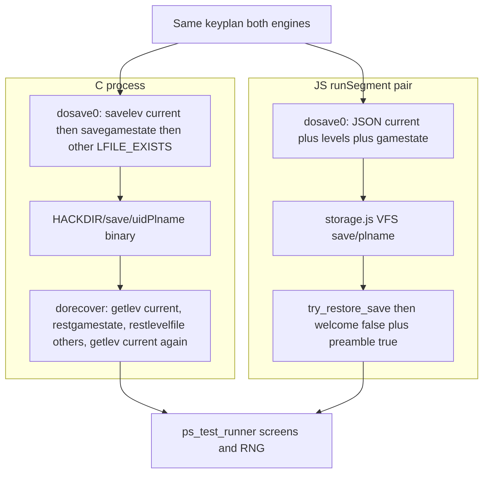

# Faithful JSON save/restore (multi-level ledger)

## Why this take exists

Public scoring is saturated (44/44). The next useful oracle is **custom C-recorded sessions that start from a save**, especially after the hero has left and returned to a floor. That is only valid if JS `S` → VFS → next `runSegment` reconstructs the same logical state C writes into `HACKDIR/save/`.

Contest sessions **do not share save bytes**. C writes binary NHFILE; JS writes JSON in frozen [`js/storage.js`](js/storage.js). Scoring compares screens/RNG. Forking works only from a prefix JS still matches. This take makes that prefix allowed to **include dungeon travel**.



## Hard non-goals (name these in map headers; do not implement)

- Binary `NHFILE` / `sfbase.c` / `Sfo_*` struct I/O in scored `js/`
- Editing frozen [`js/storage.js`](js/storage.js), [`js/isaac64.js`](js/isaac64.js), [`js/terminal.js`](js/terminal.js)
- Fuzz oracle snapshot-fork harness ([`docs/proposals/2026-08-28-differential-session-fuzzing-oracle.md`](docs/proposals/2026-08-28-differential-session-fuzzing-oracle.md) §7.7)
- Hangup save, compress, overwrite-yn, INSURANCE `savestateinlock`, uid/`nhuuid`, C `FREEING` teardown (JS `Game` dies after `S`)
- Worms, air/water bubbles, exclusion zones (keep named)
- Full bones **semantic** rewrite (ghostly id remap, fruit negation, pet-untame stay in [`js/bones.js`](js/bones.js)). The **codec primitives** unify with save (decision 2). Bones stay D-0274 for ghostly extras.
- `save_oracles` / `save_killers` / `save_bc` swallowed loose ball / `reglyph_darkroom` (no JS analogue; darkroom paint already approximated in [`js/display.js`](js/display.js))
- Endgame / tutorial `cant_go_back` teardown (`do.c:1640–1649` bare `FREEING`)

## Design decisions

1. **JSON analogue, C field order as comments, not wire format.** Missing new keys mean “old save” (D-1614/D-1628/D-1636). Keep `payload.version === 1`. Do not bump version.

2. **One level codec, three call sites.** Export `serObj` / `serMon` / `serLevel` / `deserLevel` from [`js/save.js`](js/save.js). Callers: `dosave0` / `try_restore_save`; in-session `goto_level` stays **live** pointers in `game.level_info` (no JSON mid-game); [`js/bones.js`](js/bones.js) `savebones`/`getbones` call the same codec and keep their **ghostly** wrapper. Delete the duplicate `serObj`/`serMon`/`deserObjChain` in `bones.js`. A third clone is not allowed.

3. **Do not emulate `restlevelfile` or double-`getlev`.** Those exist because C `FREEING` tears down RAM. JSON hydrates other floors into `level_info` without destroying the current map.

4. **Identity is `o_id` / `m_id`.** Worn uses `owornmask` + `setworn` + `setuwep`, not invlet. Context eating/reading uses `o_id` already stored at **use** time where JS has it; fill the remaining C sites (decision 4b). Drop the `worn` payload key.

4b. **`o_id` at use time, not only at save.** C writes `Sfo_context_info` *before* `saveobjchn`. JS already sets `tin.o_id` ([`js/eat.js`](js/eat.js) ~2101) and `spbook.o_id` ([`js/spell.js`](js/spell.js) ~807, ~937). Gaps: main-food `victual.piece` at ~1924 does not set `victual.o_id` (nonfood path ~2592–2594 does); `polearm.hitmon` has no `m_id` ([`js/apply.js`](js/apply.js) ~3971). Port those assignments at the C use sites first. On save, strip live `piece`/`tin`/`book`/`hitmon` pointers so `JSON.stringify(context)` cannot cycle; restore rebinds via ids.

5. **Invent stays a JS Array (D-1691).** Serialize in array order. Restore keeps that order.

6. **ISAAC is not in the save.** Each segment `initRng(seed)`. Match C’s restore-time RNG budget; do not persist rng ctx.

7. **`linfo` flags ≠ stash bodies.** JSON `linfo[]` analogue of `save_dungeon` `Sfo_linfo`; JSON `levels{}` analogue of concatenated `savelev` bodies. Do not round-trip the mixed `game.level_info[i]` record.

8. **Two relink sites, C’s root set, never `billobjs`.** C calls `relink_timers` / `relink_light_sources` **twice** (`timeout.c:2751`, `light.c:517`):

   | Site | C | Fixes up | JSON |
   |---|---|---|---|
   | End of every `getlev` | [`restore.c:1299–1300`](nethack-c/upstream/src/restore.c) | that floor’s RANGE_LEVEL timers/lights | `deserLevel(blob)` against **that blob’s** `fobj` / `buriedobjlist` / `fmon[].minvent` |
   | End of `restgamestate` | [`restore.c:725–726`](nethack-c/upstream/src/restore.c) | RANGE_GLOBAL, after invent (`:657`), `migrating_objs` (`:671`), `migrating_mons` (`:672`) | Cluster 4, after those three are restored, against `invent` + `migrating_objs` + `migrating_mons`/`mydogs` minvent |

   A lit lamp or candle in the hero’s pack is exactly a RANGE_GLOBAL timer plus a RANGE_GLOBAL light (`obj_is_local` is false for `OBJ_INVENT`, [`js/mkobj.js`](js/mkobj.js) ~802–819). Public `seed0105-valk-chat-lamp-ration` is in the 44. Skipping the second site leaves those holding a bare `o_id` when Cluster 5 `run_timers()` fires.

   **Do not include `billobjs`** — C panics if a timer/light points there (`shk.c:2777`; JS comment at `find_oid`). A failed relink must throw (loud ≡ C panic). Pass the roots in. Do not call [`js/shk.js`](js/shk.js) `find_oid`.

   JSON hydrates gamestate **before** installing current; C `getlev`s current **before** `restgamestate`. That order difference is a **no-op**: a RANGE_GLOBAL object is by definition non-local (`OBJ_INVENT`, `OBJ_MIGRATING`, or `OBJ_MINVENT` on a migrating/`mydogs` carrier). `fobj` / `buriedobjlist` can never hold one. Name this next to the M1 note in [`docs/c-js-map/turns.md`](docs/c-js-map/turns.md) so the next reader does not “fix” the order.

   Do **not** run one pass over all ledgers’ timers (that would insert other floors into `_timer_base` and break decision 9).

9. **M2 invariant (hard).** After `try_restore_save` returns, `_timer_base` and `light_base` contain **exactly** RANGE_GLOBAL plus the **current** ledger. Every other ledger’s timers/lights stay on `game.level_info[i].timers` / `.lights`, already relinked (decision 8 site 1), in the same shape [`js/do.js`](js/do.js) ~1485 produces so `restore_timers(info.timers)` at ~1571 is unchanged. Cluster 5 `run_timers()` (C `restore.c:930`) then cannot hatch/rot off-level objects.

10. **Stairs and trap `dst.dlevel` are stored absolute.** C savelev subtracts `u.uz.dlevel` when `tolev.dnum == u.uz.dnum` ([`save.c`](nethack-c/upstream/src/save.c) ~670–680; traps `restore.c` ~1150–1157). JSON skips the relative dance. Name that in the map; do not “forget” it.

11. **Do not persist `iflags`.** C restores `flags` only; `perm_invent` is deliberately out of the save (`restore.c` ~576–580). Segment `nethackrc` is the authority for DECgraphics / menus / perm_invent. Drop the `iflags` payload key. Hangup `iflags.save_uinwater` / `save_uburied` / `save_uswallow` stay named with hangup (non-goal).

12. **Landing: one branch, seven commits (Cluster 0–6), each independently green.** Operator gets one take; bisect lands on a cluster. Map + D-log + D-index per commit that changes behavior.

## Current vs C (gaps this take closes)

[`js/save.js`](js/save.js) `dosave0` writes a mixed current-level + partial gamestate blob. It does **not** walk `game.level_info`. After `resetGame()`, other floors are gone; `<` calls `mklev`.

**Live bug (Cluster 0):** `maketrap` pushes only `game.level.traps` ([`js/trap.js`](js/trap.js) ~969–970); `t_at` reads that array. `game.ftrap` is never the live list (`goto_level` nulls it; `maketrap` does not append). `dosave0` writes `(game.ftrap || []).map(...)` → `[]`; restore sets `map.traps = payload.ftrap || []` and **wipes every trap**. Bones already uses `(game.ftrap || lvl?.traps || [])` ([`js/bones.js`](js/bones.js) ~278). seed0013 never observes a trap after restore.

[`js/do.js`](js/do.js) stash is richer than VFS for timers, regions, track, dest areas, `lastseentyp`, `omoves`. JSON restore does not call `getlev_catchup_monsters`. `billobjs` is not stashed or cleared on leave.

Public seed0013 never descends (`>`/`<` absent from both segments).

## Payload shape (target)

Extend `version: 1`. New keys optional (missing = old save).

**Current floor uses the same `serLevel` blob as every other floor**, stored under `current` (from Cluster 2 onward). Scattered top-level map keys (`locations`, `fmon`, `fobj`, …) are **read-only for old saves** when `current` is absent. Do not keep a second field list for “the floor you are standing on” — that is how `track` / `regions` / RANGE_LEVEL timers / lights / dest areas stay lost on seed0013.

- `current`: `serLevel` blob for the live floor (`omoves` = `game.moves` at save, analogue `save.c:516`)
- `current_ledger`
- `levels`: map ledger → `serLevel` blob for **other** `LFILE_EXISTS` floors only
- `linfo`: `{ flags }[]` length `maxledgerno()` (C: `count = maxledgerno(); for (i = 0; i < count; i++)` — index `maxledgerno()` itself is **not** persisted). Synthesize `linfo[current]` on save: `goto_level` only writes `level_info[old]` on **leave**, so a hero who never left dlvl 1 has no entry.
- Per-level blob: `omoves`, `locations`, `lastseentyp`, `stairs` (absolute), `updest`, `dndest`, `level_flags`, `rooms`, `doors`, `doorindex`, `fmon`, `fobj`, `buriedobjlist`, `billobjs`, `traps` (array; not `ftrap`), `head_engr`, `bonesinfo`, `regions` (`m_id` arrays already, no pointer relink), `timers` (id-based), `track`, `lights` (id-based), `damagelist`
- Gamestate: existing fields plus `quest_status`, `pl_fruit` + `ffruit`, `artidisco`, `migrating_objs`, `migrating_mons`, `timer_global`, `timer_id`, `lights_global`, `dungeon_topology`, `tune`, `inv_pos` (`game.svi.inv_pos`), `sp_levchn` if live
- Drop: `worn`, `iflags`. Keep `flags`. Strip live context pointers; keep scalar `o_id`/`m_id`. Old payloads remain loadable: `owornmask` is already on every `serObj` scalar.

**Cluster 0 exception (stepping stone, not a second list to keep):** the codec does not exist yet, so Cluster 0 only patches traps into the **existing** scattered payload (`level.traps` in, stop wiping `map.traps`). Cluster 2 replaces that with `current: serLevel(...)`. The **trap-same-floor** recipe is what Cluster 0 turns green.

## Cluster sequence

Seven commits on one branch. **Cluster 0 ships first, alone.** Do not start Cluster 0 code until **trap-same-floor** is recorded **red** on current HEAD. Do not start Cluster 1 until trap-same-floor is green on the Cluster 0 commit.

Recipe names in this document (do not reuse review-file shorthand):

| Recipe | What it measures | Greens at |
|---|---|---|
| trap-same-floor | trap wipe on restore, same dlvl | Cluster 0 |
| ledger | descend / save / restore / ascend | Cluster 3 |
| catchup | `elapsed > 0` then `<` | Cluster 3–5 |
| shop | unpaid + `billobjs` + ascend | Cluster 3 |
| trap-ledger | discovered trap + ledger travel | Cluster 3 |

### Cluster 0 — Traps in the existing save path

C: `savetrapchn` `save.c:544`; `getlev` trap loop `restore.c:1150–1157`.

- Serialize `game.level.traps` (array). Stop writing empty `ftrap`. Restore into `map.traps` / `level.traps`.
- `serLevel` must not assume `.map` on a stash that still has a chain; codec representation is the array `t_at` already uses.
- Store `trap.dst.dlevel` absolute (decision 10).
- Bones: switch to the shared trap field (or call `serLevel`) so the two copies cannot drift again.

Falsifier: **trap-same-floor only** — same floor, no `>`/`<`. Seg0: discover a trap on dlvl 1, `Sy`. Seg1: restore, step onto it. Record **red** against current HEAD before the fix. An ascend recipe is **trap-ledger** and belongs to Cluster 3.

### Cluster 1 — Complete in-memory `savelev` stash

C: `savelev_core` ~451–566; `do.c:1642` `update_mlstmv` immediately before `savelev`; `savemonchn` `save.c:894` `forget_temple_entry` (also runs on ordinary leave because `goto_level` is `WRITING|FREEING`).

File: [`js/do.js`](js/do.js) ~1444–1577.

- **`update_mlstmv()`** before the stash (`dog.c:295–297` = `iter_mons` set `mlstmv = moves`). JS has no symbol; pets already set it in `keepdogs`. After this take `mlstmv` is persisted and drives `mon_arrive` wander. Shared helper; `savebones` should call it too (`bones.c:620`) — one call, not a bones rewrite.
- **`forget_temple_entry`** on each `ispriest` on the **leave** path and again from `serMon` (Cluster 2). C zeros `intone_time` / `enter_time` / `peaceful_time` / `hostile_time` (`priest.c:545`). Leave-only or serMon-only makes in-session vs `S` disagree. The helper is four lines; port it, do not stub. Double-zero is idempotent. **Leave-path forget runs on ordinary level change only** — C skips it on the endgame/tutorial `cant_go_back` teardown (`do.c:1649` sets `nhfp->mode = FREEING`, and `savemonchn`’s call sits inside `update_file(nhfp)`, which is false for bare `FREEING`). Both are non-goals; do not port that branch.
- `billobjs` on leave (and clear live `game.billobjs`); restore on getlev
- `damagelist` (`savedamage` / `restdamage` `save.c:549`, `restore.c:1224`) so later `fix_shop_damage` is not a no-op
- Lights: id-based `{ type, x, y, range, id }` using existing `obj_is_local` / `mon_is_local` ([`js/mkobj.js`](js/mkobj.js) ~770–800), not a cloned locality test
- Stash record shape **identical** to `deserLevel` output (Cluster 2 target)
- Confirm `omoves` / `lastseentyp` / dest / RANGE_LEVEL timers / regions / track stay
- Named: worms, bubbles, exclusions

### Cluster 2 — Shared level JSON codec

File: [`js/save.js`](js/save.js). Bones becomes a caller (decision 2). **Absorb bones `serObj` / `serMon` / `deserObjChain` into `save.js` before writing `serLevel`**, so bones cannot drift from the new codec. Do not reopen D-0274 ghostly extras.

- `serLevel` from live `game.*` or a stash; `deserLevel` returns a stash-shaped record whose `level` is `new GameMap()` + overlay ([`js/game.js`](js/game.js) ~31–59), never a plain object
- **Write the live floor as `payload.current = serLevel(...)`.** Read `current` on restore; if missing, fall back to scattered top-level keys (old save / Cluster 0 payloads)
- Timer JSON: `{ timeout, tid, kind, action, a_long, arg_id, arg_kind }` — JS timers have `action` not `func` ([`js/mkobj.js`](js/mkobj.js) ~977–986). `TIMER_MONSTER` unused (C panics if relinked)
- Relink **per blob** (decision 8 site 1, **no `billobjs`**). After deser of a **non-current** ledger, leave timers/lights on the stash; do **not** insert into `_timer_base` / `light_base` (decision 9)
- `serMon`: set `mnum` from `monsndx` analogue (`save.c:892`). Call `forget_temple_entry` (ported in Cluster 1) for `ispriest`. Re-alias `eshk.bill_p = eshk.bill` after deser (`js/shk.js:361`)
- Regions need no id relink (`reg.monsters` is already `m_id[]`, [`js/region.js`](js/region.js) ~330–336)

### Cluster 3 — Ledger in VFS

C: `dosave0` ~168–215; `dorecover` other-level loop ~869–888; `save_dungeon` ~158–187.

- `payload.current = serLevel(live)`; for each `level_info[i]` with `LFILE_EXISTS` and `i !== current_ledger`, `levels[i] = serLevel(stash)`
- **trap-ledger**, **ledger**, and **shop** recipes turn green here, not in Cluster 0
- Export `maxledgerno()` from [`js/dungeon.js`](js/dungeon.js); [`js/o_init.js`](js/o_init.js) imports it (today a private clone at `:84`). Loop `i < maxledgerno()` like C
- Persist `dungeon_topology`, `tune`, `inv_pos` **here** (same C function as `linfo` / `mapseenchn`, already live on `game` / `game.svi`)
- Synthesize current `linfo` flags + `omoves` on save: set `game.level_info[current].omoves = game.moves` so a later `>` then `<` computes elapsed against the save-time base
- `try_restore_save`: hydrate others into `level_info` with decision-8 site-1 relink and M2 “not in `_timer_base`”; install current; insert only current+global timers/lights
- Missing `levels` key: old save, current-only (seed0013)
- Cheap assertion in the **ledger** falsifier: after restore-then-`<`, count of `TIMER_OBJECT` whose `obj` is not reachable from the current level is 0

### Cluster 4 — `savegamestate` / `restgamestate`

C: `savegamestate` ~264–332; `restgamestate` ~525–735.

**First in this commit:** victual `o_id` on the main-food path; `polearm.m_id` next to `hitmon` (decision 4b). Null live pointers on save.

Then:

- Worn: delete `worn` key; walk invent; `setworn(o, o.owornmask)`; `setuwep` so `unweapon` recomputes (C ~687–699). Include amulet/blindfold via mask, not a slot table. `save_bc` loose ball stays named
- Drop `iflags` (decision 11)
- `quest_status`, `migrating_objs` / `migrating_mons`, fruit chain, `artidisco`
- `save_timers(RANGE_GLOBAL)` + persist `game.timer_id` (`timeout.c` RANGE_GLOBAL arm; today named omit at `js/mkobj.js:974`) + RANGE_GLOBAL lights
- **Global relink at C’s position** (`restore.c:725–726`): after invent and migrating chains are restored, relink RANGE_GLOBAL timers/lights against `invent` + `migrating_objs` + `migrating_mons`/`mydogs` minvent (minus `billobjs`, decision 8). This is a separate helper from `deserLevel`’s per-blob relink; do not fold them into one pass over `_timer_base` while other ledgers are installed.
- Named defer: uid, nhuuid, urealtime, wreserve, killers, oracles, `save_bc`

### Cluster 5 — `dorecover` envelope

C: `dorecover` ~788–950; getlev post ~1181–1220.

**Invariant (M6), not a hardcoded `elapsed == 0` story:** C `getlev`s current twice. First pass `REST_GSTATE` before `Sfi_you`, so `u.uz.dlevel == 0` and the catchup loop `continue`s before `restore_cham`. Second pass `REST_CURRENT_LEVEL` has `elapsed = moves - omoves == 0`, so `restore_cham` runs and `hide_monst`/`rnd(10)` do not. JSON has one install of current. Testable rule: **exactly one `restore_cham` per current-level monster per restore; zero `restore_cham` for every other ledger.** `restore_cham` → `normal_shape` → `newcham` can consume RNG; a double pass is seed0013-visible on PfSC/mcan.

Also:

- `set_residency(mtmp, false)` for `isshk`; `place_monster`; `hideunder` for `mundetected` hiders (C ~1183–1196). `m_at` has an `fmon` fallback; `level_mon_at` / shop residency do not
- Steed/ustuck via `m_id`
- C order after current `getlev` (`restore.c:922–931`); do not paraphrase:

```c
inven_inuse(FALSE);
reglyph_darkroom();       /* JS: named omit — no analogue; skip this line */
vision_reset();
gv.vision_full_recalc = 1;
run_timers();             /* last of this group; only legal if M2 holds */
program_state.restoring = 0;
```

  `run_timers` is async and can `pline` (rot/burn/hatch). Running it before `vision_reset` reorders what the following `docrt` paints.
- `beyond_savefile_load = 1` (already D-1603) after `restoring = 0` / early_raw wait (C `:942`)
- `docrt`; `welcome(FALSE)` then `check_special_room(FALSE)`
- Preamble: `read_engr_at` / `fix_shop_damage` (needs Cluster 1 `damagelist`)
- Moon/Friday undo+reapply unchanged (seed0013). Always `vfsDeleteFile`. Add unixmain “Restoring save file...” only if a recorded C screen actually shows it

### Cluster 6 — Docs and D-rows

- [`docs/c-js-map/harness.md`](docs/c-js-map/harness.md), [`absent.md`](docs/c-js-map/absent.md), [`turns.md`](docs/c-js-map/turns.md): ledger ported; binary still deferred; both relink sites; RANGE_GLOBAL pack-lamp case; JSON gamestate-before-current is a no-op for global timers; absolute stairs/traps; dropped `iflags`/`worn`; `cant_go_back` forget skip named
- [`docs/DIVERGENCE-LOG.md`](docs/DIVERGENCE-LOG.md) + [`docs/DIVERGENCE-INDEX.md`](docs/DIVERGENCE-INDEX.md) per behavior commit (runbook §G). Contiguous D-block, not one mega-row
- [`docs/CURRENT.md`](docs/CURRENT.md) / [`docs/NOTES.md`](docs/NOTES.md) / journal tail
- Do not edit GROK-PLAYBOOK, Constitution, runbook, frozen patches
- `debt.md` only if Cluster 2 fails to absorb bones primitives (should not happen)

## Verification

Do **not** add files to [`sessions/manifest.json`](sessions/manifest.json). Cadence stays 44. `rng-diff` is segment 0 only.

**B0 (gate).** Record **trap-same-floor** against current HEAD **before Cluster 0 code**. Record **ledger** / **catchup** / **shop** / **trap-ledger** before the cluster that is supposed to turn them green (ledger travel = Cluster 3). Write first-divergence and RNG/screen counts in the table. A falsifier never seen red is not a falsifier.

| Recipe | HEAD SHA | First divergence | RNG | Screen | Notes |
|---|---|---|---|---|---|
| trap-same-floor (Cluster 0) | `605f0f2e` | seg1 step1 no "Really step into that pit?" | 4404/4414 | 14/17 | No stairs. `ftrap:[]` wipe. After D-1694: 4414/4414 17/17 |
| ledger descend/save/restore/ascend | `bfdadc33` | seg1 `<` JS mklev vs C getlev; then dog 1-cell (C `mon_arrive` vs JS `hide_monst` rnd(10)) | 8408/8472 | 25/26 | Same datetime. Geometry green Cluster 3 (8412/8472). Dog green D-1699: **8472/8472 26/26** |
| catchup `elapsed > 0` then `<` | after D-1698 | same remainder as ledger (restlevelfile restamp zeros elapsed) | 8489/8549 | 29/30 | Wait was in seg0; C restamp → elapsed 0 on `<`. After D-1699: **8549/8549 30/30** |
| shop unpaid / billobjs | *unrecorded* | — | — | — | Needs ledger (ascend). Not claimed green. |
| trap-ledger | *unrecorded* | — | — | — | Cluster 3; not Cluster 0. Not claimed green. |

**A. Public regression (must stay PASS + strict)**

```bash
node frozen/ps_test_runner.mjs \
  sessions/seed0013-friday13-save-then-fullmoon-restore.session.json \
  sessions/seed8000-tourist-starter.session.json \
  sessions/seed0900-tourist-explore-actions.session.json
node scripts/strict-output-check.mjs \
  sessions/seed0013-friday13-save-then-fullmoon-restore.session.json \
  sessions/seed8000-tourist-starter.session.json \
  sessions/seed0900-tourist-explore-actions.session.json
```

**B. Ledger recipe (same datetime both segments).** v5, same `OPTIONS=name:`, seg0 ends `Sy`, seg1 `<` to dlvl 1. Do **not** vary seed/datetime on the first ledger recipe (moon/Friday already covered by seed0013). Datetime-varying variant is a **second** recipe after ledger is green.

Machine pass: `ps_test_runner` `RNG n/n, Screen m/m` and `strict-output-check` pass, with `n`,`m` recorded. “Visited map not fresh mklev” goes in the recipe `.note.json`, not as the scorer predicate.

**C. Catchup recipe.** Seg0: descend, wait, save on dlvl 2. Seg1: restore, `<`. RNG after that boundary is meaningful only if monster **set and `fmon` order** already match C (`rnd(10)` once per monster). Prefer a floor with a small, stable population.

**D. Shop recipe.** Shop on dlvl 1, pick up unpaid, descend, save, restore, ascend. Hits `billobjs`, `eshk.bill_p`, `set_residency`, `damagelist`.

**E. Trap recipes (two, not one).**

- **trap-same-floor (Cluster 0).** Discover a trap on dlvl 1, `Sy`, restore, step on it. No `>`/`<`. This is the only trap recipe Cluster 0 can turn green.
- **trap-ledger (Cluster 3).** Discovered trap, descend, save, restore, ascend. Do not use trap-ledger as Cluster 0’s B0 row.

**F. Stairs cohort** after Clusters 3–5: existing seed0015 / seed0700 / seed0014 (in-session stash, not VFS).

**G. Constitution:** no `fs`/`path`/`node:*` in scored `js/`; no DIAG/FORCE; no seed names or recorded coordinates in production control flow.

## Risks

- Breaking M2 reintroduces D-1037 on restore (`run_timers` + other-level hatch)
- Skipping the `restgamestate` relink leaves pack lamps/candles as bare `o_id`; `run_timers` then fires in Cluster 5
- Double `restore_cham` desyncs RNG on PfSC/mcan
- Global `find_oid` during deser cannot see stash `fobj` (failed relink) or, if objects were merged into RAM, fires the wrong level
- `JSON.stringify(context)` with live `victual.piece` in a container throws; strip pointers
- Invent Array vs nobj
- Mixing `linfo` with stash bodies
- **trap-ledger** failing on HEAD is mostly the missing ledger; do not treat that as Cluster 0 evidence. **trap-same-floor** is the trap-wipe measurement.

## Unlocks after this take (not this plan)

Snapshot-fork: record a long directed prefix once, keep C `save/` and JS VFS, mutate only segment 2. Requires this ledger and M2. Independent of binary NHFILE.
