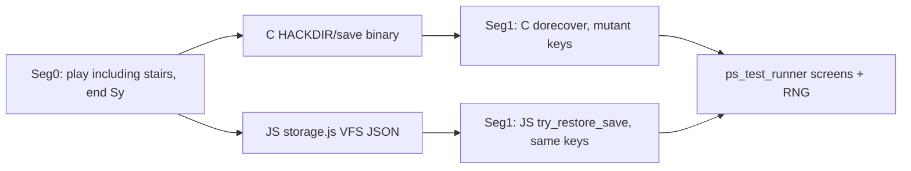

# Proposal: save-prefixed private oracles and snapshot-fork

**Status:** proposal for human / auditor review. **Not adopted.**
Loop agents must not treat this file as playbook, constitution, or
runbook. Do not edit loop scripts, `GROK-PLAYBOOK.md`,
`PORTING-RUNBOOK.md`, `CONSTITUTION.md`, `js/`, or
`sessions/manifest.json` from this note.

**Date:** 2026-08-30.
**Author:** Grok, at operator request after JSON ledger D-1694…D-1699
(`736b74ec` / Cluster 5; Cluster 6 B0 at `f562b693`).
**Checked against tree:** `f562b693`, public suite 44/44 fortress.
**Depends on:** [`2026-08-28-differential-session-fuzzing-oracle.md`](2026-08-28-differential-session-fuzzing-oracle.md)
C3 spec (document of record for the generator / corpus / consumption
path). This note does **not** reopen C3 ranking, sealing, or loop
wiring.
**Intent:** decide how the porter workflow should change now that a
custom C-recorded prefix may include dungeon travel and `S`, and JS
restore reconstructs other visited floors instead of `mklev`.

---

## 1. The question

The public 44 are a saturated meter. Playbook §2a already says: treat
them as a regression fortress; pick work from named map omissions;
optional private C-recorder canaries. The missing piece was not
philosophy. It was **honesty of the canary**.

Until D-1699, a recipe that did `>` then `Sy` then restored was not
evidence about getlev. JS rebuilt the old floor with `mklev`. The only
honest save oracles were:

- same-dlvl restore (public `seed0013-friday13-save-then-fullmoon-restore`)
- in-session stash (`goto_level` without process death)

The operator question after the ledger take: *can we improve the
porting strategy now?*

Yes, but the improvement is an **evidence channel**, not a new work
picker. Map-driven mode stays. Sessions stay not the spec.

---

## 2. Verdict

**ADOPT A NARROW DELTA. DO NOT REPLACE §2a.**

Three concrete changes, in this order:

1. **Falsifier-first for restore-shaped and other-floor-shaped map
   rows.** Record a short private recipe red, then port. The ledger
   clusters already proved this works. It is *not* required for every
   named omit (wear clones, getobj, `#wipe` do not need a save).
2. **Multi-segment first-miss dump** (`rng-diff` today runs only
   segment 0). Ledger bugs live in segment 1. This is a script, not a
   strategy essay.
3. **Snapshot-fork as an operator/audit instrument** (fuzzing proposal
   §7.7, previously deferred). Record one directed prefix that JS still
   matches, snapshot C `save/` **and** JS VFS separately, mutate only
   the restore segment. Consumption stays C3: human/audit, minimizer +
   pinned C locus before any Must-fix row. Never inside a port
   iteration. Never `sessions/manifest.json`.

Do not copy C NHFILE bytes into JS VFS. Do not feed first-diff
one-liners into `LOOP-QUEUE.md`. Do not wait for “no remaining named
omissions” before using save-prefixed recipes — that inverts the
tool, same mistake C3 already rejected.

---

## 3. What is already true (do not rebuild)

| Piece | State |
|---|---|
| JSON ledger including other `LFILE_EXISTS` floors | D-1694…D-1699. Private B0: trap-same-floor 17/17, ledger 26/26, catchup 30/30. Shop / trap-ledger **unrecorded**. |
| M2 | After `try_restore_save`, `_timer_base` / `light_base` = RANGE_GLOBAL + **current** ledger only. Other floors stay on `level_info[i]`. |
| M6 | One `restore_cham` per current-level monster per restore; zero for every other ledger until `goto_level`. |
| C `savelev` timestamp | Writes `svm.moves`. `restlevelfile` during dorecover restamps other ledgers, so the next getlev sees `elapsed==0`. JS analogue: `restampOtherLedgerOmoves`. **Wait-then-save-then-restore-then-`<` does not test catchup.** Catchup-after-restore is restore, *then* wait, *then* `<`. |
| Recorder later segments keep `save/` | `scripts/record-session.mjs` `wipeSave: isFirstSegment`. |
| JS later segments share VFS | `frozen/ps_test_runner.mjs` one `storage` Map per session; `try_restore_save` then `vfsDeleteFile`. |
| C3 generator | `scripts/fuzz-oracle.mjs` already exists (preflight / batch / minimize / corpus / triage). Tail-mutates public last segments and independent chargen shorts. **Not** snapshot-fork. |
| C3 consumption | Human or audit. Must-fix only after minimize **and** a C locus. Mechanical coverage vs named-omit vs fidelity buckets. |
| Private corpus convention | `private-sessions/README.md`. Cadence stays the public 44. |
| `rng-diff.mjs` | Concatenates C rng across segments, then **replays only segment 0** on JS. |

---

## 4. What the ledger actually unlocked

A two-segment recipe is a valid C-vs-JS oracle at scoring granularity
when:

- both segments share `OPTIONS=name:` and the same datetime (moon /
  Friday already covered by seed0013; do not vary datetime on the
  first travel recipe);
- segment 0 ends `Sy`;
- later segments keep C `save/` and JS VFS;
- JS `payload.levels` hydrates other `LFILE_EXISTS` floors with M2
  (timers not inserted into `_timer_base`);
- identity is `o_id` / `m_id` (D-1698), not invlet.

That is **independent of binary NHFILE**. The scorer never compares
save bytes.

Snapshot-fork is the same diagram with the prefix recorded **once**.
Mutants start from copies of `cSave` and `jsVfs`. They do not replay
800 prefix keys.

---

## 5. What it did not unlock

- Byte-compatible saves. C `save/` stays NHFILE. JS stays JSON.
  Copying one into the other is a bug, not a shortcut.
- Shop billing / `billobjs` / trap-after-travel. Those recipes were
  never recorded red. Do not claim them green.
- Named omits that are not restore-shaped. `getobj_wear` is still a
  same-floor getobj problem.
- Honest elapsed catchup on the first `<` after restore. C restamped
  `omoves`. A catchup falsifier must spend turns **after** restore.
- Sealed holdout (AUDIT-ROADMAP P2-5). Still deferred per C3. Save
  prefixes make a *future* sealed cohort stronger; they do not create
  one.
- Permission to invent FAIL peels from public traces.

---

## 6. Playbook §2a delta (propose only — a human edits the playbook)

Add one paragraph under “Optional private C-recorder canaries”, not a
new priority rank above the map:

> When the named omit is **restore-shaped** or **other-floor-shaped**
> (getlev, `billobjs`, shop residency after `<`, trap `t_at` after
> travel, RANGE_LEVEL timers after restore), the falsifier is a
> private C-recorded recipe in `private-sessions/`, recorded **red**
> before the JS change. Segment 0 may include stairs and must end
> `Sy` if the omit is observed after restore. Do not add it to
> `sessions/manifest.json`. The public 44 remain the fortress.
> Non-restore omits keep today’s same-floor canary / focused public
> session / C-read packet.

Also amend the `rng-diff` row in playbook §5: “segment 0 only” is a
tool limitation, not a law. Multi-segment first-miss is required for
save-prefixed recipes.

Do **not** add: “prefer fuzz hits over the map”; “loop runs
snapshot-fork”; “green path includes private corpus”.

---

## 7. Snapshot-fork design

### 7.1 Why it is now cheap

JS `runSegment` always `resetGame()` + `initRng(seed)` +
`try_restore_save` if VFS has a save. After a prefix that ended `Sy`,
the save is still in storage (restore has not run). Cloning that Map
is the JS snapshot.

C `record-session.mjs` already keeps `save/` across later segments.
Copying that directory into an isolated HACKDIR (path ≤ 128 chars,
same `nh_getenv` / `BUFSZ/2` rule as C3) is the C snapshot.

Neither mutant replays the prefix.

### 7.2 Prefix contract (hard)

A prefix is forkable only if **JS already PASSes it** (full RNG +
screen + cursor + `strict-output-check` on that private session).
Forking a red prefix measures prefix debt, not the mutant.

Prefix recipe:

- one segment, ends `Sy`;
- same datetime as the mutant segment;
- `OPTIONS=name:` set (no askname);
- no `pettype:none` on the seed0015 stairs path (that path needs the
  dog);
- directed toward a *named* map omit or a thin system, not a random
  walk through `#` wizard keys unless the omit is wizmode.

After recording prefix on C, run JS `runSegment` once with a shared
storage handle. Snapshot:

- C: `HACKDIR/save/` (and `bones/` if the prefix created bones);
- JS: `JSON.stringify([...storage.entries()])` of the VFS Map.

Do not snapshot after a restore segment: both engines delete the save.

### 7.3 Mutant segment

Each mutant is a **one-segment** recipe whose process start is
dorecover:

- C: copy snapshot `save/` into a fresh short HACKDIR; `wipeSave:
  false` on this recording; drive mutant keys.
- JS: load cloned VFS; `runSegment({ seed, datetime, nethackrc,
  moves, storage })`.

**Seed rule:** pin one restore-segment seed for the whole fork family
(ledger used `99999`; public seed0013 uses its own). Do not reuse the
prefix seed unless that is an explicit experiment. ISAAC is not in
the save; `initRng(seg.seed)` runs every segment. Mixing seeds inside
one family makes diffs incomparable.

**Datetime rule:** same as prefix unless the omit *is* moon/Friday
(seed0013). Travel recipes keep datetime stable.

**nethackrc rule:** identical to prefix. `iflags` / DECgraphics /
`perm_invent` are not in the save (D-1698).

### 7.4 Scoring

Same frozen comparator as C3 (`scripts/lib/fuzz-compare.mjs`). Do not
re-derive normalization. Elide C-vs-JS `built <date>` banner before
treating a screen miss as gameplay (`private-sessions/README.md`).

Vacuous-recording floor: mutant session step count ≥
`moves.length + 1` (restore welcome/preamble plus keys).

### 7.5 M2 check (private falsifier, not scored `js/`)

After JS `try_restore_save` of a multi-level save, count of
`TIMER_OBJECT` on `_timer_base` whose `obj` is not reachable from
current-level invent / fobj / buried / fmon minvent / migrating is 0.
Failed relink still **throws** in production (loud ≡ C panic). Do not
put this assertion in scored control flow; put it in the fork wrapper
or a private recipe `.note.json` command.

### 7.6 Where the code lives

New operator script, e.g. `scripts/snapshot-fork.mjs`, wrapping
`record-session.mjs` + `runSegment`. Optional later: `fuzz-oracle.mjs
batch --mode fork --prefix <recipe>` that consumes a **green** prefix
snapshot. Isolated `/tmp/nhfz/wN` installs, same 128-char HACKDIR
cap. Output recipes/sessions under `.cache/fuzz/` (gitignored) until
minimized into `private-sessions/`.

Do not teach `fuzz-oracle.mjs` tail-mutation to append `Sy` on public
Dlvl-1 sessions and call that fork. That still never leaves the
public neighborhood.

---

## 8. Multi-segment `rng-diff`

Extend `scripts/rng-diff.mjs` (or a sibling) to:

- share storage across segments like the test runner;
- compare per-segment and concatenated;
- print which segment owns the first miss, local index, and C `@
  file:line` when present.

Keep today’s default as segment 0 so existing one-segment habits do
not surprise. Save-prefixed work passes `--all-segments`.

This is independently useful even if snapshot-fork waits.

---

## 9. Consumption and anti-overfit

Inherit C3 consumption **verbatim**:

- Dashboard by RNG delta (severity).
- Queue by RNG-clean first, then smallest screen delta, then
  shortest minimized suffix, then “already a named omit?”
- Mechanical coverage (`Unknown command` / direction / extended
  command / role-init throw) is never copied to `private-sessions/`.
- Named-omit bucket: suppress only against a **named** deferral in a
  `c-js-map` section or module header. Not `absent.md` alone.
- A hit becomes a Must-fix row only after minimization **and** a
  pinned C function, at audit density — a few rows, not fifteen.
- The session is evidence of a bug, never the specification of a
  fix. No seed names, recorded coordinates, or RNG indices in
  production `js/` control flow.

**Map still picks ordinary loop work.** A fork hit that cites an
already-named omit is a debt signal, not a peel. A fork hit that
cites live C JS already claimed to port is a Must-fix candidate.

---

## 10. Non-goals

- Binary NHFILE / `sfbase.c` / editing frozen `storage.js`
- Hangup save, compress, INSURANCE, uid/`nhuuid`
- Copying C `save/` into JS VFS or the reverse
- Wiring snapshot-fork or private corpus into `agent-port-loop.sh`
- Growing `sessions/manifest.json`
- Sealed meter (P2-5) in this take
- Replacing map-driven Open refill with a fuzz queue
- DIAG / FORCE / `fastforward.js` entries
- Treating wait-before-save as elapsed catchup

---

## 11. Staged landing

| Stage | What | Owner | Gate |
|---|---|---|---|
| A | This proposal; human may land the §2a paragraph | human | review |
| B | `rng-diff --all-segments` | operator or one small commit | green + ledger 26/26 still PASS |
| C | Record shop and trap-ledger **red** (still missing B0) before claiming those paths | operator | red on current HEAD |
| D | `snapshot-fork.mjs` prefix snapshot + N mutants; no loop wiring | operator | prefix PASS; mutants triage via C3 buckets |
| E | Optional `fuzz-oracle` `--mode fork` | operator | C3 preflight still 44/44 |
| F | Sealed independent cohort | later | C3 “ranking right more than once” |

Each stage is independently useful. Do not couple B–E into one
“strategy rewrite” commit.

---

## 12. First prefixes worth forking (after they are green)

Already green, forkable once the wrapper exists:

- `private-sessions/ledger-seed0015-valk-descend-save-ascend` — other
  floor after restore. Mutant segment today is `"< "`.
- `private-sessions/trap-same-floor-seed0005-tourist` — same-dlvl
  restore. Useful for inven / trap / `run_timers` mutants, not travel.

Record red first, then port, then fork:

- **shop:** unpaid pickup, descend, `Sy`, restore, `<` (billobjs,
  `eshk.bill_p`, `set_residency`, `damagelist`).
- **trap-ledger:** discover trap, descend, `Sy`, restore, `<`.
- **catchup-after-restore:** descend, `Sy`, restore, wait on the
  save floor, then `<` (elapsed > 0 after restamp).

Do not fork wizard `#levelchange` / debug alphabets unless the named
omit is wizmode. That neighborhood is not a held-out proxy.

---

## 13. Recommendation

Adopt stages A–C immediately as operator practice. Build D when a
human wants volume; it is not a prerequisite for using save-prefixed
falsifiers one at a time (the ledger take already did that by hand).

Keep C3’s consumption path. The ledger made §7.7 *possible*. It did
not make raw triage a work list.

---

## Review (Grok, 2026-08-30)

**Status:** self-review of the proposal above, against `f562b693`.
Not playbook. Same rules: do not consume as a work list.

**Verdict: ACCEPT-WITH-DEBT.** The thesis is right. The draft still
packages three different sizes of change as one “strategy”
improvement, understates how much C3 already exists, and would let
“falsifier-first” stall ordinary map peels if a human pastes §6 into
the playbook without the restore-shaped qualifier.

### 0. What was actually checked

| Claim | Check | Result |
|---|---|---|
| `rng-diff.mjs` replays only segment 0 | `scripts/rng-diff.mjs:41–47` `runSegment` of `session.segments[0]` only; C rng concatenated from all segs | **True.** A two-segment first miss is attributed to the wrong engine if you use it as-is. |
| Recorder keeps `save/` after seg0 | `record-session.mjs:361–436` `wipeSave: isFirstSegment` | **True.** |
| JS restore deletes the save | `js/save.js` `vfsDeleteFile` after successful `try_restore_save` | **True.** Snapshot must be taken after prefix `Sy`, not after a restore segment. |
| C3 generator already ships | `scripts/fuzz-oracle.mjs` + `private-sessions/README.md` | **True.** The draft is not “build an oracle.” It is “stop deferring §7.7.” |
| Tail-mutation is not fork | `buildTailMutant` edits last-segment `moves`; `buildIndependent` is one chargen segment | **True.** Mutating seed0013’s restore tail still never descended. |
| Wait-before-save ≠ catchup | Cluster 5 first miss was C `mon_arrive` `rn2(10)` vs JS getlev `rnd(10)`; restamp zeros elapsed | **True.** §3 must stay in any adopted note or the next agent will re-record the catchup recipe wrong. |
| Shop / trap-ledger unrecorded | Cluster 6 B0 table; no `private-sessions/shop-*` / `trap-ledger-*` sessions in the take | **True.** Stage C is not optional flavor. |
| M2 / failed relink throw | D-1696/D-1698/D-1699; `relink` throws | **True.** Putting an M2 count in scored `js/` would be DIAG. Wrapper-only is the right line. |
| Playbook bans loop agents from editing itself | `GROK-PLAYBOOK.md` §8 | **True.** §6 is a *proposed paragraph*, not a commit in this take. |

Did not re-run the public 44 for this review. Cluster 5 already ran
green+strict, seed0013, stairs, lamp, and the shared cohort.

### 1. What the proposal gets right

- Evidence channel vs work picker. Replacing §2a with a fuzz queue
  would spend the fortress on symptom patches. C3 already lost that
  argument once.
- NHFILE / JSON split. The scorer compares screens and RNG. Oracle
  validity never needed byte compatibility.
- Prefix-must-be-green. Forking a red prefix is how you launder
  mklev-vs-getlev into fifty “mutant” misses.
- Catchup restamp. That was the actual D-1699 needle. If this note
  forgot it, the next catchup recipe would be a false red.
- Staged landing. `rng-diff --all-segments` is a twenty-line fix
  and unblocks hand recipes today. Snapshot-fork is optional volume.

### 2. Must-fix before anyone implements D

**M1. Do not advertise this as a porting-strategy replacement.** The
title is fine; §2’s “narrow delta” is the actual claim. A human
skimming §13 could still land a playbook bullet “prefer private
save recipes over the map.” That contradicts §2a rank 1 (`CURRENT.md`
primary / map Open). Fix: §6 stays one paragraph, restore-shaped
only, explicitly *under* “optional canaries.”

**M2. Inherit C3 consumption by reference, do not paraphrase into a
second ranking.** §9 already says “verbatim” and then restates the
sorts. Two restatements will drift. Adopted text should cite
the 2026-08-28 C3 “Consumption” and “Triage” blocks and stop.

**M3. Prefix snapshot contents are underspecified.** C `save/` file
names include uid on some installs (`files.c` `SAVEF`). The contest
recorder path is plname under `save/`. The wrapper must copy the
**whole** `save/` directory from the isolated HACKDIR used to record
the prefix, not glob `save/<plname>` from the developer’s main
install. Bones, if any, are a separate snapshot key. Locks must not
be copied (recorder already strips them on later segments).

**M4. JS storage clone must happen before `try_restore_save` of any
mutant, and must include the JSON save blob.** Cloning after a
failed experiment that restored will snapshot an empty VFS.
Document `structuredClone` / `JSON.parse(JSON.stringify([...entries]))`
of the Map *immediately* after the prefix `runSegment` returns.

**M5. Mutant welcome/preamble RNG is in-bounds.** Seg1 of the ledger
recipe matches lua shuffle then `mon_arrive`. A fork wrapper that
skips `welcome(false)` / `moveloop_preamble(true)` / `check_special_room`
will desync before the mutant keys. The mutant is a full
`runSegment`, not a mid-moveloop inject. Say that once in §7.3.

### 3. Should-fix

**S1. Split the commits.** Stage B (`rng-diff`) should not wait on
D. The draft’s table says that; §13 “adopt A–C immediately” buries
B inside “practice.” Land B as its own tiny commit.

**S2. Falsifier-first scope.** Without the restore-shaped qualifier,
loop agents will refuse to port `do_wear` until someone records a
save recipe. §6 has the qualifier; put it in the verdict box too
(now done in this review’s reading of §2 — keep it if §2 is edited).

**S3. Seed `99999` is a convention, not C.** Public seed0013 uses a
different restore seed. The wrapper should take `--restore-seed` and
default to the prefix seed **or** a documented constant, not silently
copy the ledger’s `99999`. Incomparable families are a triage tax.

**S4. Cost sentence.** Snapshot-fork wins when prefix length ≫ mutant
length. For a 20-key prefix, replaying is simpler and avoids snapshot
bugs. The wrapper should refuse to snapshot prefixes shorter than a
threshold (suggest 80 keys, matching C3 explore tails) or just
document “use hand two-segment recipes below that.”

**S5. Do not add `--mode fork` to `fuzz-oracle.mjs` in the first
wrapper commit.** Optional stage E. Teaching one script two persistence
models (replay-from-chargen vs restore-from-snapshot) is how
`wipeSave` gets flipped on a fork worker.

### 4. Missing scope

- **In-session stash vs VFS.** Fork mutants that `<` without `S` in
  the *mutant* still exercise `goto_level` stash, which was already
  green on public seed0015. That is a valid path, but it is not the
  ledger oracle. Label recipes `vfs-restore` vs `in-session` in
  `.note.json`.
- **Bones.** Prefixes that leave a bones file are a different snapshot
  (D-0274 ghostly still named). Out of this take, but the copy step
  will silently include `bones/` if we say “copy HACKDIR residue.”
  Either copy `save/` only or name bones as a non-goal on the wrapper.
- **`program_state.restoring` / REST_LEVELS.** JSON never
  REST_LEVELS-hydrates others. That is decision 3 of the ledger plan
  (no double-getlev). Fork mutants that expect C’s REST_LEVELS
  `continue` during dorecover of *other* files will not see a JS
  analogue — and should not, because those files are not live. Do not
  “fix” that in a fork wrapper.
- **Chrome.** Wrapper is Node operator tooling. Rule #2 still applies
  to scored `js/`. No `fs` in the port.

### 5. Process

Loop agents: may implement Stage B (rng-diff) and may record private
recipes if `CURRENT.md` primary says so. May **not** edit the
playbook, loop scripts, or manifest. May **not** treat this file as
Open refill.

Human: if adopting §6, paste the paragraph into `GROK-PLAYBOOK.md` §2a
and the `rng-diff` footnote in §5. Do not paste §7 into the playbook.

Audit: private `corpus --check` stays C3. Snapshot-fork hits join that
corpus only after minimize. Do not gate cadence 44 on them.

### 6. Amended landing (replaces §13 if there is conflict)

1. **Keep the public fortress and map-driven picker.** Unchanged.
2. **Land Stage B now** (`rng-diff --all-segments`). Independently
   green. Needed for any save-prefixed hand recipe.
3. **Record shop and trap-ledger red** (Stage C) before any JS that
   claims those paths. Hand two-segment recipes. No wrapper required.
4. **Use save-prefixed hand recipes as falsifiers** only when the
   named omit is restore- or other-floor-shaped. That is operator
   practice today; the playbook paragraph can wait for a human.
5. **Build `snapshot-fork.mjs` later**, copy whole isolated `save/`,
   clone VFS immediately after prefix `runSegment`, full `runSegment`
   for mutants, prefix must PASS, `--restore-seed` explicit, `save/`
   only (not bones unless a bones take), C3 triage, no loop wiring, no
   `fuzz-oracle --mode fork` in the same commit.
6. **Do not** implement a sealed meter, NHFILE import, or playbook
   rank change in this take.

The instrument is the ledger plus a prefix snapshot. The strategy
change is “stop pretending same-floor seed0013 tests getlev.”
Everything else is volume and hygiene.
